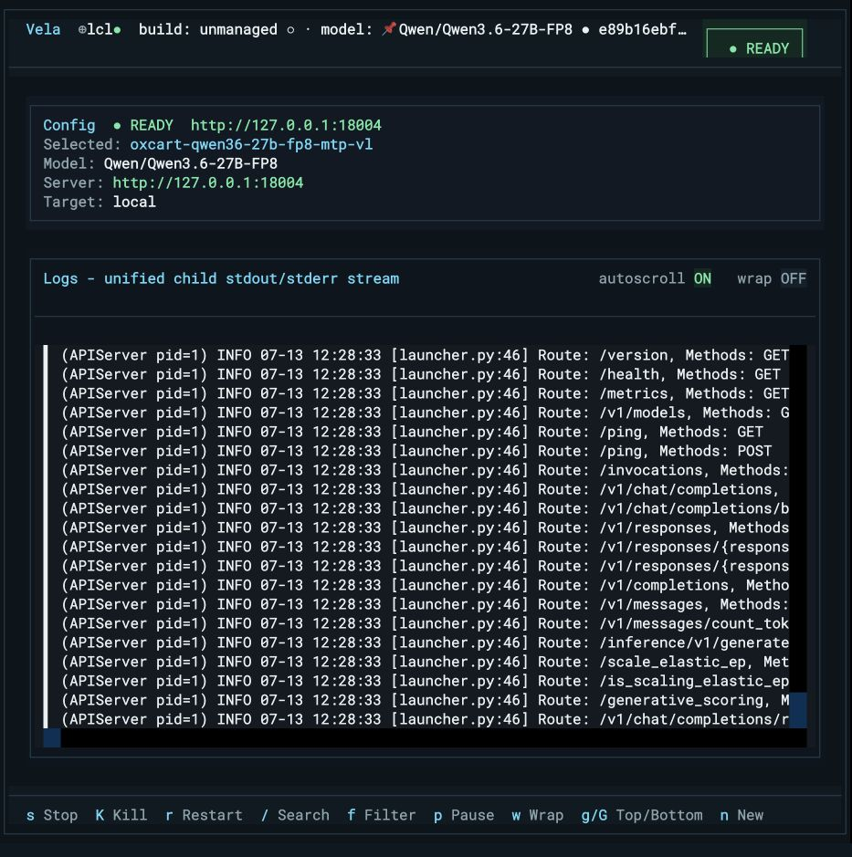

# Vela

`vela` is a Python package and terminal TUI for launching vLLM servers
from named YAML configs, watching scrubbed logs, tracking load phases, probing
readiness, and managing per-target builds and model pins.

The current architecture is controller/agent based: the controller can run on a
workstation while a target agent owns process lifecycle, sidecars, GPU sampling,
health checks, build installs, and model downloads on the host that actually has
the files and GPUs.



The complete application manual is in [docs/index.md](docs/index.md). If this is
your first time using Vela, follow [Getting started](docs/getting-started.md) and
then the illustrated [first deployment tutorial](docs/tutorials/first-deployment.md).

## Documentation

| I want to… | Start here |
| --- | --- |
| Install Vela or run the no-GPU demo | [Getting started](docs/getting-started.md) |
| Understand controllers, targets, profiles, pins, builds, and runs | [Core concepts](docs/concepts.md) |
| Create, save, cold-reload, launch, verify, and stop a real profile | [First deployment tutorial](docs/tutorials/first-deployment.md) |
| Operate targets, configs, models, builds, flags, logs, and runs | [Operations guide](docs/operations.md) |
| Find every CLI command and option | [CLI reference](docs/cli-reference.md) |
| Author or review YAML | [Configuration reference](docs/configuration.md) |
| Resolve an error banner | [Troubleshooting](docs/troubleshooting.md) |
| Look up every TUI key | [TUI key reference](docs/tui.md) |

The screenshot-led docs use 34 byte-for-byte copies from the checksummed live
Oxcart workflow. Their source commit and hashes are recorded in
[`docs/img/tutorial/manifest.json`](docs/img/tutorial/manifest.json).

## Quickstart

There are two golden paths. Pick the one that matches how you got Vela.

### Installed tool

Install Vela as a standalone CLI tool (Python 3.10+) and open the TUI — this is
the path for driving remote GPU targets from a workstation:

```bash
uv tool install git+https://github.com/bgconley/vela
# or: pipx install git+https://github.com/bgconley/vela
vela
```

Shell completion is built in: `vela --install-completion`. `vela` and `vela tui`
are equivalent.

An installed tool ships no configs, so first use is TUI-first — you compose
deployments and reach targets from inside the TUI:

1. Open `vela` on the controller host.
2. Press `t` to open Target Manager and add or test a GPU target (or bootstrap one
   from the CLI — see [Remote Targets](#remote-targets)).
3. Press `n` to compose a deployment with the New Deployment wizard.
4. Launch from the TUI, watch phase/readiness/logs, then stop or reattach from the
   same screen.

The full keyboard reference for every TUI screen is in
[docs/tui.md](docs/tui.md).

### Cloned repo

Clone the repo and install it editable with dev extras — this is the path for
hacking on Vela and running the bundled no-GPU demo:

```bash
git clone https://github.com/bgconley/vela
cd vela
pip install -e ".[dev]"
```

The repo ships a `./configs` directory that includes the `fake-child` deployment
(a no-GPU vLLM stand-in), so the demo commands below work out of the box **as long
as you run from the repo root** — config discovery finds `./configs` there. None
of these need a GPU:

```bash
vela list                        # lists fake-child from ./configs
vela run fake-child --preview    # print the resolved command, launch nothing
vela smoke fake-child            # launch the fake child, wait READY, stop
```

Other useful no-GPU checks (also from the repo root):

```bash
vela targets list
vela build list
vela model list
vela deploy create --help
```

When a launch, connection, or model job surfaces an error banner, the remediation
for each error kind is in [docs/troubleshooting.md](docs/troubleshooting.md).

## Remote Targets

The golden path provisions a target over SSH in one command: it reaches the host,
discovers or installs the agent, registers the target on the controller, and
handshakes it.

```bash
vela targets bootstrap gpu-node --host user@host --install
vela targets test gpu-node
```

`bootstrap` writes the target to the controller's `~/.config/vela/targets.yaml`
for you; `--install` installs the Vela agent into the target's managed venv (drop
it when the agent is already on the host). `local` is always implicit. An SSH
target runs `vela agent connect` on the remote host; that per-connection agent
process performs the host-local work. It does not require or restart a shared
host daemon.

Make a target the default so you can omit `--target`:

```bash
vela targets use gpu-node          # persists the default; or export VELA_TARGET=gpu-node
vela list                          # now runs against gpu-node
```

On target-aware commands, an explicit `--target` wins over `VELA_TARGET`, the
default saved by `vela targets use`, and finally the implicit `local`. Controller-
local commands such as `version` and `runs prune` do not accept a target.

### Hand-edited targets.yaml (reference)

`vela targets bootstrap` is the supported path. Edit
`~/.config/vela/targets.yaml` directly only when you need a field bootstrap does
not set:

```yaml
targets:
  gpu-node:
    transport: ssh
    host: user@gpu-host
    workdir: /home/user/repos/vela
    venv: /home/user/venvs/vela
    local_transport: socket
```

The two-hop workstation → controller → agent validation lane and the artifact
workflow are a maintainer runbook — see
[docs/gpu-workflow.md](docs/gpu-workflow.md) (maintainer runbook).

## Config Schema

Config discovery runs on the target agent, because configs usually reference
target-local paths. Discovery order is:

1. `--configs-dir <dir>` (explicit override)
2. `$VELA_CONFIGS`
3. `./configs` — the `configs/` subdir of the current directory (this is why the
   cloned-repo demo works when you run from the repo root)
4. `~/.config/vela/configs` — the `configs/` **subdir** of `~/.config/vela`, not
   `~/.config/vela` itself. `$XDG_CONFIG_HOME` overrides `~/.config`, so this
   becomes `$XDG_CONFIG_HOME/vela/configs` when that variable is set.

Common YAML fields:

```yaml
name: qwen-example
target: gpu-node               # optional home target label
model: Qwen/Qwen3.6-27B-FP8
model_ref: pinned-qwen        # optional registry entry id, display name, or repo id
revision: main               # optional model revision or commit
command:
  entrypoint: serve
  build: vllm-0-11-2
  runtime: process
  cwd: /home/user/repos/vela
# For an unmanaged process, use `executable` instead of `build`; they are
# mutually exclusive.
engine:
  tensor_parallel_size: 1
  gpu_memory_utilization: 0.9
server:
  host: 127.0.0.1
  port: 8000
  exposure: local
logging:
  request_logging: false
env:
  CUDA_VISIBLE_DEVICES: "0"
extra_args: []
launch:
  mode: detached
  ready_timeout_seconds: 900
vllm:
  version_profile: "0.11"
```

Details are in [docs/configuration.md](docs/configuration.md).
Use `exposure: lan` or `exposure: public` only when the target should bind a
non-loopback or wildcard address; `exposure: local` is rejected for those binds.

Docker deployments use `command.runtime: docker` plus `command.docker`. The
agent generates `docker run`, owns container lifecycle, records container id and
image digest in the sidecar, and stops with `docker stop -t`. Details are in
[docs/docker-runtime.md](docs/docker-runtime.md).

## New Deployments

The TUI is the primary way to create a launchable config. Press `n` or choose
**New Deployment** from the command palette, then step through target, runtime,
model, customization, review, save, and smoke. The wizard calls the target agent
for composition, validation, preview, preflight, save, and smoke; the controller
does not run Docker or dereference target-local paths.

The complete six-step journey—including immutable image/build identity, exact
model pinning, field provenance, secret redaction, Save versus Save & Smoke,
cold restore, READY verification, and graceful Stop—is documented with live UI
captures in the [first deployment tutorial](docs/tutorials/first-deployment.md).
Day-two clone/edit/delete/export workflows are in the
[operations guide](docs/operations.md#deployment-profiles).

Headless CI and operator scripts can use the same composer surface:

```bash
vela deploy create qwen36-bf16 \
  --target gpu-node \
  --model Qwen/Qwen3.6-27B \
  --runtime docker \
  --image 'your-registry/vllm-openai@sha256:<validated-64-hex-digest>' \
  --port auto \
  --json

vela deploy export qwen36-bf16 --target gpu-node --output /tmp/qwen36-bf16.sh
```

Replace the image placeholder with a digest validated for the target's GPU,
CUDA, and vLLM stack. Omitting `--image` is valid only when a matching
target-side recipe supplies it.

## Build Methods

Managed builds are per-target venvs under the target data dir. They can be
created, verified, selected, repaired, removed, or adopted from an external
venv:

```bash
vela build add --target gpu-node --method pip --spec 'vllm==0.11.2' --label vllm-0-11-2
vela build verify vllm-0-11-2 --target gpu-node
vela build select vllm-0-11-2 --target gpu-node
```

Build methods: `pip`, `nightly`, `commit`, `git`, `wheel`, and `adopt`.
`nightly` and `commit` require `uv` on the target because pip cannot enforce
the index-priority semantics those wheel feeds need. `pip`, `wheel`, and `git`
can fall back to Python venv plus pip.

Details are in [docs/builds-and-models.md](docs/builds-and-models.md).

## Model Registry

Models are cataloged, not owned. Hugging Face weights stay in the target's
standard HF cache; the agent records only metadata, pins, and verification state
in its registry.

```bash
vela model pin tiny-llama \
  --target gpu-node \
  --repo-id hf-internal-testing/tiny-random-LlamaForCausalLM \
  --revision main
vela model download tiny-llama --target gpu-node
vela model verify tiny-llama --target gpu-node
```

Keep `HF_TOKEN` on the target host for gated repos. Tokens are scrubbed before
job output leaves the agent.

## Agent/RPC Overview

The controller talks to a target through a uniform `TargetClient`. The agent
owns launch, stop, kill, restart, preflight, sidecar identity verification,
phase FSM, durable log scrubbing, health, GPU sampling, build jobs, and model
jobs. The controller passes run/job ids and renders events; it never signals
PIDs or dereferences target-local paths.

Core RPCs include `handshake`, `list_configs`, `preflight`, `preview`,
`launch`, `stop`, `kill`, `restart`, `subscribe`, `discover_runs`,
`reattach`, `list_builds`, `create_build`, `list_models`, and
`download_model`.

Details are in [docs/agent-rpc.md](docs/agent-rpc.md).

## Tested Matrix

The matrix below is the maintainer's lab reference surface, not a required
topology. The reference lab surface is a Linux controller driving an RTX PRO 6000
Blackwell (sm_120) agent with the Qwen3.6 27B native Docker stacks. Dated
validation records live under `artifacts/remote-validation/`.

The current branch proof is the July 13 Oxcart controller-and-target workflow at
`artifacts/human-workflow-validation/2026-07-13/oxcart-cd9569a5643a-20260713T121208Z/`.
It covers two repeatable real Qwen3.6 27B FP8 Docker launches, text and vision
endpoint checks, cold profile restoration, wrong-host safety, manager and
responsive-layout walkthroughs, and cleanup. Start with its `report.md` and
`manifest.json`; `tag_ready` remains false until the external release gates named
there are complete.

Historical Blackbird/P620 artifacts and the commands for producing new ones are
kept in [docs/gpu-workflow.md](docs/gpu-workflow.md). Treat all named lab
surfaces as evidence for those exact revisions—not as a promise that a different
vLLM build, image, GPU, or model has been validated.

## Security Notes

Run artifacts default to `~/.local/state/vela/runs/` on the target.
Durable logs are scrubbed before display and persistence and are created with
mode `0600`.

vLLM API keys do not protect every network-reachable endpoint, including
`/invocations`. Keep the default localhost binding unless the host is protected
by a firewall or reverse proxy.

For stricter shared-host policy, set `VELA_AGENT_TOKEN` in both the
target agent environment and the controller environment. The token is checked
during the first agent handshake and is optional for a single-user
controller/agent topology. Generate a strong token with
`vela agent gen-token`; configured tokens must be a single non-whitespace
value with at least 128 bits of entropy.

## License

MIT — see [LICENSE](LICENSE).
