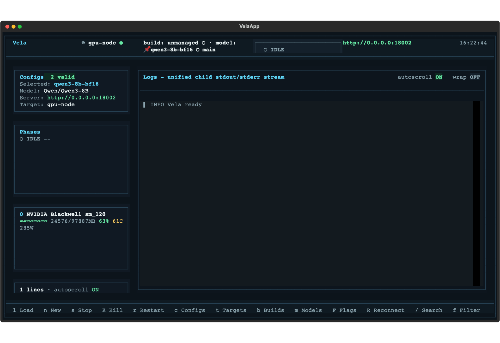
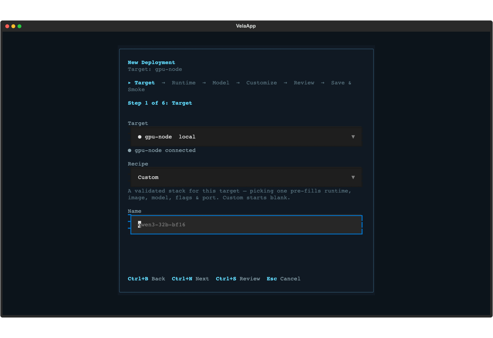
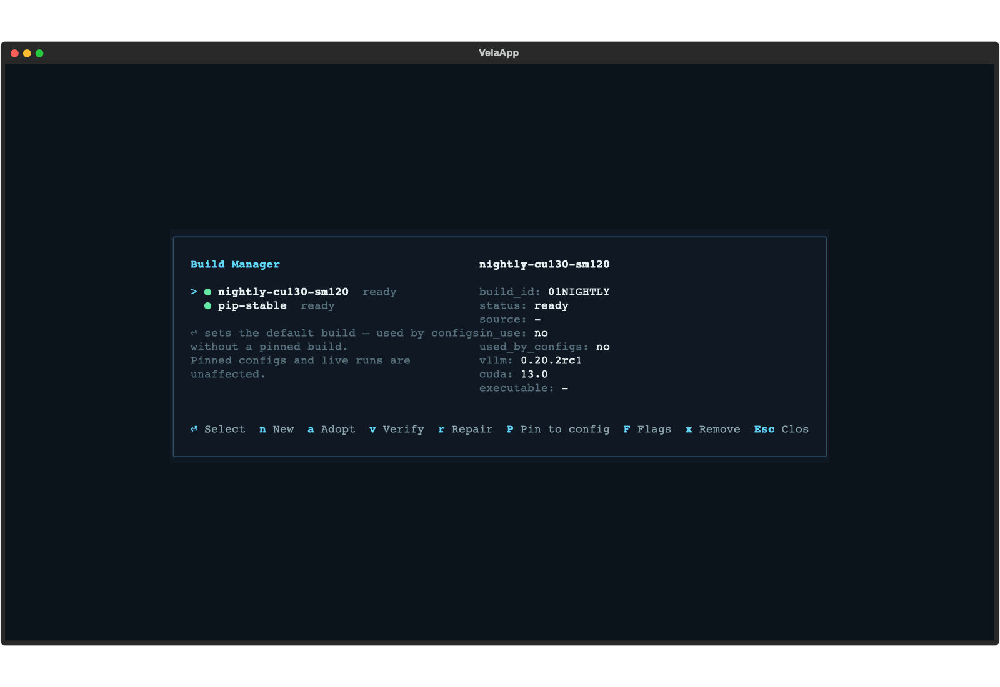

# Vela

`vela` is a Python package and terminal TUI for launching vLLM servers
from named YAML configs, watching scrubbed logs, tracking load phases, probing
readiness, and managing per-target builds and model pins.

The current architecture is controller/agent based: the controller can run on a
workstation while a target agent owns process lifecycle, sidecars, GPU sampling,
health checks, build installs, and model downloads on the host that actually has
the files and GPUs.



<details>
<summary>More screenshots: New Deployment wizard, Build Manager</summary>





</details>

(Regenerate with `python3 scripts/readme_screenshots.py docs/img` — rendered
headlessly with placeholder-only state.)

## Quickstart

Install as a tool (Python 3.10+) and open the TUI:

```bash
uv tool install git+https://github.com/bgconley/vela
# or: pipx install git+https://github.com/bgconley/vela
vela
```

For development, install editable with dev extras instead:

```bash
pip install -e ".[dev]"
```

Shell completion is built in: `vela --install-completion`.

The explicit TUI alias is equivalent:

```bash
vela tui
```

Typical first use is TUI-first:

1. Open `vela` on the controller host.
2. Press `t` to open Target Manager and add or test a GPU target.
3. Press `n` to compose a deployment from the New Deployment wizard, or select
   an existing YAML config from the sidebar.
4. Launch from the TUI, watch phase/readiness/logs, then stop or reattach from
   the same screen.

Useful no-GPU checks:

```bash
vela list
vela preview fake-child
vela run fake-child --preview
vela smoke fake-child
vela targets list
vela build list
vela model list
vela deploy create --help
```

## Remote Targets

Targets are stored on the controller in `~/.config/vela/targets.yaml`.
`local` is implicit. An SSH target runs `vela agent connect` on the
remote host; the remote daemon then performs all host-local work.

Example target:

```yaml
targets:
  gpu-node:
    transport: ssh
    host: user@gpu-host
    workdir: /home/user/repos/vela
    venv: /home/user/venvs/vela
    local_transport: socket
```

Register and test a target from the CLI:

```bash
vela targets add gpu-node \
  --host user@gpu-host \
  --workdir /home/user/repos/vela \
  --venv /home/user/venvs/vela
vela targets test gpu-node
```

For workstation-to-controller-to-agent validation across two hosts, prefer a key
available on the controller or `ProxyJump`. In a private lab, the outer
workstation-to-controller hop can use forwarding, but Vela blocks agent
forwarding on the controller-to-agent target transport.

```bash
VELA_SSH_OPTS="-A -i ~/.ssh/id_ed25519 -o BatchMode=yes" \
VELA_REMOTE_VENV=/home/user/venvs/vela \
VELA_REMOTE_TARGET=gpu-node \
VELA_REMOTE_BUILD_SPEC=vllm==0.11.2 \
VELA_REMOTE_MODEL_REPO=hf-internal-testing/tiny-random-LlamaForCausalLM \
VELA_REMOTE_REAL_RESUME_CONFIG=tiny-llama-detached \
  scripts/run_remote_tests.sh user@controller-host /home/user/repos/vela \
  my-real-config
```

See [docs/gpu-workflow.md](docs/gpu-workflow.md) for the repeatable GPU
validation lane and artifact workflow.

## Config Schema

Config discovery runs on the target agent, because configs usually reference
target-local paths. Discovery order is:

1. `--configs-dir`
2. `VELA_CONFIGS`
3. `./configs`
4. `~/.config/vela/configs`

Common YAML fields:

```yaml
name: qwen-example
target: gpu-node               # optional home target label
model: Qwen/Qwen3.6-27B-FP8
model_ref: pinned-qwen        # optional registry entry id, display name, or repo id
revision: main               # optional model revision or commit
command:
  entrypoint: serve
  executable: ./scripts/launch_vllm.sh
  build: vllm-0-11-2
  runtime: process
  cwd: /home/user/repos/vela
engine:
  tensor_parallel_size: 1
  gpu_memory_utilization: 0.9
server:
  host: 127.0.0.1
  port: 8000
  exposure: local
logging:
  request_logging: false
env:
  CUDA_VISIBLE_DEVICES: "0"
extra_args: []
launch:
  mode: detached
  ready_timeout_seconds: 900
vllm:
  version_profile: "0.11"
```

Details are in [docs/configuration.md](docs/configuration.md).
Use `exposure: lan` or `exposure: public` only when the target should bind a
non-loopback or wildcard address; `exposure: local` is rejected for those binds.

Docker deployments use `command.runtime: docker` plus `command.docker`. The
agent generates `docker run`, owns container lifecycle, records container id and
image digest in the sidecar, and stops with `docker stop -t`. Details are in
[docs/docker-runtime.md](docs/docker-runtime.md).

## New Deployments

The TUI is the primary way to create a launchable config. Press `n` or choose
**New Deployment** from the command palette, then step through target, runtime,
model, customization, review, save, and smoke. The wizard calls the target agent
for composition, validation, preview, preflight, save, and smoke; the controller
does not run Docker or dereference target-local paths.

Headless CI and operator scripts can use the same composer surface:

```bash
vela deploy create qwen36-bf16 \
  --target gpu-node \
  --model Qwen/Qwen3.6-27B \
  --runtime docker \
  --port auto \
  --json

vela deploy export qwen36-bf16 --target gpu-node --output /tmp/qwen36-bf16.sh
```

## Build Methods

Managed builds are per-target venvs under the target data dir. They can be
created, verified, selected, repaired, removed, or adopted from an external
venv:

```bash
vela build add --target gpu-node --method pip --spec 'vllm==0.11.2' --label vllm-0-11-2
vela build verify vllm-0-11-2 --target gpu-node
vela build select vllm-0-11-2 --target gpu-node
```

Build methods: `pip`, `nightly`, `commit`, `git`, `wheel`, and `adopt`.
`nightly` and `commit` require `uv` on the target because pip cannot enforce
the index-priority semantics those wheel feeds need. `pip`, `wheel`, and `git`
can fall back to Python venv plus pip.

Details are in [docs/builds-and-models.md](docs/builds-and-models.md).

## Model Registry

Models are cataloged, not owned. Hugging Face weights stay in the target's
standard HF cache, while the loader stores metadata, pins, and verification
state.

```bash
vela model pin tiny-llama \
  --target gpu-node \
  --repo-id hf-internal-testing/tiny-random-LlamaForCausalLM \
  --revision main
vela model download tiny-llama --target gpu-node
vela model verify tiny-llama --target gpu-node
```

Keep `HF_TOKEN` on the target host for gated repos. Tokens are scrubbed before
job output leaves the agent.

## Agent/RPC Overview

The controller talks to a target through a uniform `TargetClient`. The agent
owns launch, stop, kill, restart, preflight, sidecar identity verification,
phase FSM, durable log scrubbing, health, GPU sampling, build jobs, and model
jobs. The controller passes run/job ids and renders events; it never signals
PIDs or dereferences target-local paths.

Core RPCs include `handshake`, `list_configs`, `preflight`, `preview`,
`launch`, `stop`, `kill`, `restart`, `subscribe`, `discover_runs`,
`reattach`, `list_builds`, `create_build`, `list_models`, and
`download_model`.

Details are in [docs/agent-rpc.md](docs/agent-rpc.md).

## Tested Matrix

The matrix below is the maintainer's lab reference surface, not a required
topology. The reference lab surface is a Linux controller driving an RTX PRO 6000
Blackwell (sm_120) agent with the Qwen3.6 27B native Docker stacks. Dated
validation records live under `artifacts/remote-validation/`.

Latest validation artifacts:

- Commit `17a7865`: `artifacts/remote-validation/2026-06-13T01-35-02Z-bgconley-10.25.0.50-qwen36-27b-fp8-kvfp8-rp6000-blackbird-remote-validation.md`
  covers the P620 controller to Blackbird target path, entire 1118-test remote
  suite, daemon-restart and reconnect-resume probes, managed `vllm==0.11.2`
  build install, tiny HF model pin/download, Qwen3.6 27B FP8 `smoke-tui`,
  backend evidence, and real-model resume/daemon restart.
- Commit `17a7865`: `artifacts/remote-validation/2026-06-13T01-41-25Z-bgconley-10.25.0.50-qwen36-27b-bf16-rp6000-blackbird-remote-validation.md`
  covers the same P620-to-Blackbird target path with a targeted 151-test remote
  slice, Qwen3.6 27B BF16 `smoke-tui`, and backend evidence.

Earlier full-green BF16 artifact:

- `artifacts/remote-validation/2026-06-10T07-47-58Z-bgconley-10.25.0.51-qwen36-27b-bf16-rp6000-blackbird-remote-validation.md`

Earlier native-Docker artifacts:

- `artifacts/remote-validation/2026-06-06-p620-blackbird-native-docker-fp8-d67b3a6.md`
  for `qwen36-27b-fp8-kvfp8-rp6000-blackbird` on `:18003`.
- `artifacts/remote-validation/2026-06-06-p620-blackbird-native-docker-bf16-9b107b4.md`
  for `qwen36-27b-bf16-rp6000-blackbird` on `:18002`.

The earlier self-hosted GitHub Actions artifact,
`artifacts/remote-validation/2026-06-04T20-04-41Z-bgconley-10.25.0.50-qwen36-27b-fp8-kvfp8-rp6000-blackbird-remote-validation.md`,
covers managed vLLM build install, tiny HF model pin/download, Qwen3.6 27B FP8
`smoke-tui`, and real-model resume/daemon restart.

The fallback 620-01 host-local lane covers the Qwen3-32B FP8 lab surface. Treat
these as tested lab surfaces; when bumping vLLM, rerun the remote validation
lane and update fixtures/profile rules if startup or error text changes.

## Security Notes

Run artifacts default to `~/.local/state/vela/runs/` on the target.
Durable logs are scrubbed before display and persistence and are created with
mode `0600`.

vLLM API keys do not protect every network-reachable endpoint, including
`/invocations`. Keep the default localhost binding unless the host is protected
by a firewall or reverse proxy.

For stricter shared-host policy, set `VELA_AGENT_TOKEN` in both the
target agent environment and the controller environment. The token is checked
during the first agent handshake and is optional for a single-user
controller/agent topology. Generate a strong token with
`vela agent gen-token`; configured tokens must be a single non-whitespace
value with at least 128 bits of entropy.

## License

MIT — see [LICENSE](LICENSE).
