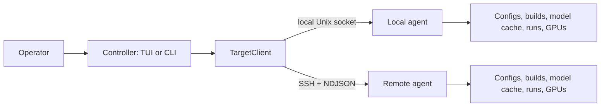
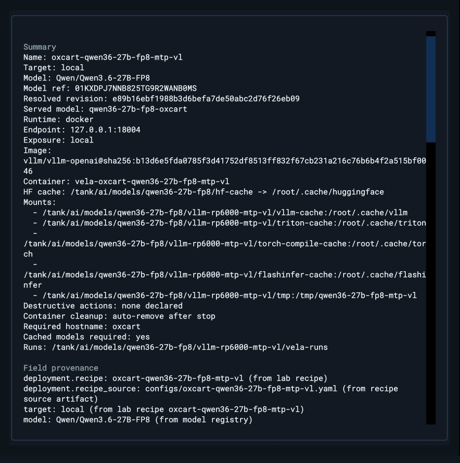

# Vela core concepts

[Documentation home](index.md) · [Getting started](getting-started.md) ·
[Configuration](configuration.md) · [Agent RPC](agent-rpc.md)

Vela separates an operator interface from target-local authority. Understanding
that boundary makes the TUI, CLI, YAML schema, and safety rules fit together.

## Controller and agent

The **controller** is the `vela` TUI or CLI process you interact with. It chooses
a target, sends typed requests, renders events, and displays scrubbed results.

The **agent** runs on the target host. It alone owns target-local actions:

- discovering and writing configs;
- resolving model caches and managed builds;
- composing and preflighting commands;
- starting, stopping, killing, and reattaching runs;
- controlling Docker containers;
- sampling GPUs and probing health;
- writing sidecars, manifests, and scrubbed durable logs.



The controller passes run and job IDs for lifecycle operations. It does not
signal a PID, retain a Docker handle, or dereference a target-local sidecar path.
That rule prevents a controller on one machine from accidentally treating its
own filesystem or process table as the target's.

## Targets and transports

A **target** names one agent authority.

- `local` is implicit. It normally uses a long-lived Unix-socket daemon on the
  current host.
- An SSH target starts `vela agent connect` on the remote host for that
  connection. The same request and event contracts cross both transports.
- `in_process` exists for tests, not normal operator configuration.

Target selection resolves in this order:

1. an explicit `--target NAME`;
2. `VELA_TARGET`;
3. the persisted default set by `vela targets use NAME`;
4. implicit `local`.

The optional `target:` value in a deployment config records its intended home
and helps expose wrong-host choices. The active CLI/TUI target still decides
which agent receives the operation.

## The identity equation

Vela's operational identity is:

```text
target × runtime/build × model@revision × config → run
```

Each term answers a different question:

- **Target:** which host owns the work?
- **Runtime/build:** which immutable software environment runs vLLM?
- **Model at revision:** which exact weights are served?
- **Config:** which server, engine, logging, environment, and launch choices are
  applied?
- **Run:** which supervised execution of that saved identity is active now?

A human-readable label is useful for selection, but it is not sufficient proof
of execution identity. New process deployments save a managed `build_id`;
new Docker deployments save a full `repo@sha256:<digest>` image; pinned Hugging
Face models resolve to a full commit SHA. Review shows those resolved values and
where defaults came from.



## Configs and recipes

A **config** is target-discovered YAML describing one reusable deployment. It
contains the model, runtime, engine flags, endpoint, exposure, logging policy,
environment overlay, extra arguments, and launch policy.

Config discovery happens on the agent because values may refer to target-local
builds, caches, working directories, or volumes. The search order is:

1. `--configs-dir`;
2. `VELA_CONFIGS`;
3. `./configs` in the agent's working directory;
4. `~/.config/vela/configs` (honoring `XDG_CONFIG_HOME`).

A **recipe** is a validated starting shape for a known target/workload. Selecting
one can fill runtime, image, model, flags, cache mounts, and port. Selecting
Custom means no lab recipe is active; Vela restores the operator's pre-recipe
draft instead of silently retaining derived launch values.

Saving is not launching. **Save** writes a validated config and creates no model
process or container. **Save & Smoke** writes it, performs a bounded
launch/READY/stop check, and returns to the saved deployment.

## Process and Docker runtimes

Vela supports two runtime families:

### Process

A process deployment launches through a target-side executable environment. A
new reproducible profile selects a managed build and persists its immutable
`build_id`. Bare executables and the current environment remain readable for
compatibility, but the New Deployment flow does not present them as immutable
saved identities.

### Docker

A Docker deployment makes the image the build artifact. Vela requires a full
repository digest for newly composed profiles, generates `docker run`, streams
`docker logs`, waits on the container, records its name/id/digest, and verifies
that identity before a stop or kill. The target agent—not the controller—owns
those Docker actions.

See [Docker runtime](docker-runtime.md) for pull policy, cache mounts, container
cleanup, preview, smoke, migration, and export.

## Builds

A **build** is a target-owned vLLM environment, normally a managed virtualenv.
Build methods include stable pip packages, nightly/commit wheels, Git source,
local wheels, and adoption of an existing venv.

The registry records a stable build ID, human label, method, resolved versions,
verification state, and usage. Selecting a default build affects configs that do
not pin one; a config with `command.build` keeps its own identity. Live-run and
config-pin guards prevent unsafe removal.

## Models and the Hugging Face cache

The model registry is a **catalog**, not a second weight store.

- A Hugging Face pin records repo, revision/commit, metadata, gating, cache, and
  verification state.
- A local-path entry points at operator-owned files on the target.
- A URL entry is launch-time metadata unless a separate fetcher handles it.

Hugging Face weights remain in the target's normal cache. `vela model download`
fills that cache; shallow verification checks expected inventory when an upstream
manifest exists; deep verification establishes and later compares a hash
baseline. Gated repositories require `HF_TOKEN` on the target, where agent-side
scrubbing can protect it.

The Model Manager's **Use once** action applies a temporary model override to one
launch attempt for the selected profile. It is cleared after consumption and
cannot cross a config switch; it does not rewrite the saved config.

## Runs, jobs, phases, and readiness

A **run** is one supervised launch. It has a run ID, immutable identity fields,
a phase history, scrubbed logs, and a target-local sidecar/manifest. Detached
runs can be rediscovered and reattached after a controller disconnect.

Vela recognizes the loading lifecycle rather than treating startup as one long
spinner:

```text
IDLE → STARTING → RESOLVING_MODEL → DOWNLOADING_MODEL → LOADING_WEIGHTS
     → PROFILING_KV → CAPTURING_GRAPHS → SERVER_STARTING → READY
```

Some workloads skip phases that do not apply. A healthy server can move from
READY to DEGRADED; intentional closure becomes STOPPED; classified failures
become ERROR.

READY is not inferred from one promising log line. The agent probes the
configured health endpoint and verifies the served model identity. `vela smoke`
uses that gate and then stops automatically.

A **job** is a bounded agent operation such as creating a build or downloading a
model. Jobs emit progress and completion events and can be cancelled without
turning the controller into the owner of their subprocesses.

## Paths and durable state

Paths belong to the agent host:

- config defaults: `~/.config/vela/`;
- managed builds: `~/.local/share/vela/builds/`;
- model registry metadata: `~/.local/state/vela/models/registry.json`;
- Hugging Face weights: the target's Hugging Face cache;
- runs and logs: `~/.local/state/vela/runs/`;
- local socket: resolved from `VELA_AGENT_RUNTIME_DIR`, `XDG_RUNTIME_DIR`, or
  the Vela state directory.

`XDG_CONFIG_HOME`, `XDG_DATA_HOME`, `XDG_STATE_HOME`, and `XDG_RUNTIME_DIR`
change these defaults. `vela doctor --target NAME` and
`vela agent status --target NAME` report the resolved target-side truth.

## Safety and trust boundaries

- Logs are scrubbed agent-side before display or persistence; durable log files
  are mode `0600`.
- Destructive lifecycle actions verify sidecar/process or container identity
  immediately before signaling.
- Loopback exposure is the safe default. `lan` and `public` require an explicit
  acknowledgement and an appropriate firewall, reverse proxy, or other access
  control.
- The browser-served TUI can launch, kill, and inspect workloads. Bind it only to
  loopback and reach it through a trusted tunnel; never expose it as an
  unauthenticated public service.
- Shared-host agents can require a high-entropy capability token. Install a
  matching controller/target token with
  `vela agent gen-token --install --target NAME`.
- Keep `HF_TOKEN`, API keys, and other secrets on the target. Review, preview,
  logs, and exported scripts use redaction or runtime requirements instead of
  publishing literal values.

For exact transport and authentication behavior, continue with
[Agent RPC](agent-rpc.md). For YAML fields, discovery, exposure, and daemon
details, continue with [Configuration](configuration.md).
