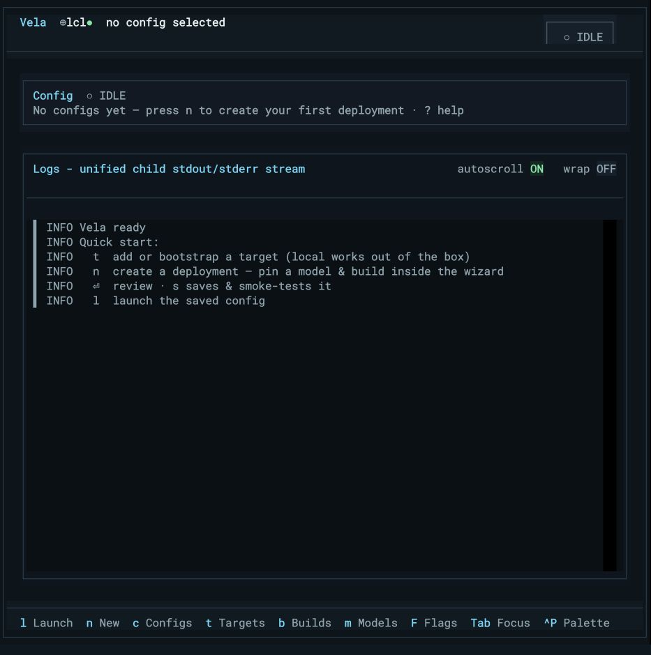

# Getting started with Vela

[Documentation home](index.md) · [Core concepts](concepts.md) ·
[CLI reference](cli-reference.md) · [Troubleshooting](troubleshooting.md)

This guide takes you from installation to a healthy first run. It includes a
no-GPU path for evaluating Vela from a clone and the supported path for adding a
remote GPU target.

## Prerequisites

Vela itself requires:

- Python 3.10 or newer;
- a terminal (80 columns works; a wider terminal makes the dashboard and Review
  screen easier to scan);
- `uv` or `pipx` for an isolated command-line-tool installation, or Git plus
  `pip` for a source checkout.

The controller does not need a GPU or a local vLLM installation. Runtime
requirements live on the target:

- an SSH target needs non-interactive SSH access and Python capable of running
  the Vela agent;
- a process deployment needs a usable vLLM executable or managed build on that
  target;
- a Docker deployment needs Docker, its pinned image, and access to the selected
  GPUs and model cache.

The repository's `fake-child` deployment needs none of those target runtime
dependencies and is the safest first exercise.

## Install as a standalone tool

Use this path when Vela is an operator tool on a workstation or controller.
`uv` is recommended:

```bash
uv tool install git+https://github.com/bgconley/vela
vela --version
```

The equivalent `pipx` installation is:

```bash
pipx install git+https://github.com/bgconley/vela
vela --version
```

Both commands create an isolated Python environment and expose `vela` on your
shell path. If the command is not found immediately, follow the path guidance
printed by `uv` or `pipx`, then open a new shell.

### Update or remove an installed tool

For an installation managed by `uv`:

```bash
uv tool upgrade --reinstall vela
uv tool uninstall vela
```

For an installation managed by `pipx`:

```bash
pipx upgrade vela
pipx uninstall vela
```

Use the update command without the uninstall command when you only want the
latest revision. After updating controller code, restart a long-lived local
agent if Vela reports a revision mismatch:

```bash
vela agent restart
```

## Install from a source checkout

Use this path to develop Vela, run its tests, or use the checked-in example
configs:

```bash
git clone https://github.com/bgconley/vela
cd vela
python3 -m venv .venv
source .venv/bin/activate
python -m pip install -e ".[dev]"
vela --version
```

Because this is an editable installation, source changes are immediately
visible. After pulling dependency or metadata changes, refresh the environment:

```bash
git pull --ff-only
python -m pip install -e ".[dev]"
```

To remove the package from the active environment:

```bash
python -m pip uninstall vela
```

## Enable shell completion

Vela can install completion for the current shell:

```bash
vela --install-completion
```

Restart the shell afterward. To inspect the completion script instead of
installing it, use:

```bash
vela --show-completion
```

## Diagnose the controller before first use

Run the read-only doctor before configuring a target:

```bash
vela doctor
```

It reports controller paths and setup checks with corrective commands. For
automation, add `--json`. Once a target exists, include it in the diagnosis:

```bash
vela doctor --target gpu-node
vela targets test gpu-node
```

If Doctor reports a named agent, authentication, build, model, or discovery
failure, use the matching section in [Troubleshooting](troubleshooting.md). Do
not work around an agent-side error by copying target paths or secrets into the
controller.

## First run of an installed tool

An installed Vela tool intentionally ships without deployment configs. Open the
TUI with either command:

```bash
vela
# Equivalent:
vela tui
```

The first-run dashboard is an honest empty state with the next actions in its
log panel:



From this screen:

1. Press `?` or `F1` for Help. `Ctrl+P` opens the command palette containing
   every available action.
2. Press `t` to inspect targets. `local` is always present.
3. Press `n` to create a deployment. The wizard can pin a model and select or
   create a build without leaving the flow.
4. Review the resolved identity and redacted command before saving.
5. Press `l` or `Enter` on a saved config to launch it; press `s` to stop.

The generated [TUI key reference](tui.md) lists screen-level bindings. The
[Deployments guide](deployments.md) explains the immutable build/image and model
requirements enforced by the wizard.

## Try the no-GPU demo from a clone

Run these commands from the repository root. Config discovery finds
`./configs/fake-child.yaml`; an installed tool used from another directory does
not include that file.

First list and preview the config. Preview resolves the command but starts
nothing:

```bash
vela list
vela run fake-child --preview
```

Next, exercise the normal attached CLI lifecycle:

```bash
vela run fake-child
```

Wait for READY, then press `Ctrl+C`. Vela asks the agent to stop its owned run
and exits after the terminal lifecycle result. For a bounded, non-interactive
check, use smoke instead:

```bash
vela smoke fake-child
```

`smoke` launches the same config, waits for health and the expected
`/v1/models` identity, then stops automatically. A successful smoke returns exit
status zero.

You can also exercise the workflow in the real TUI:

```bash
vela
```

Select `fake-child`, press `l`, and watch the phase timeline reach READY. Press
`s` and verify the explicit operator closure and STOPPED phase. The screenshot
walkthrough is intentionally kept in the [real deployment tutorial](tutorials/first-deployment.md),
where every image depicts the exact profile being discussed; this no-GPU demo
does not substitute unrelated real-model images for `fake-child` output.

This demo proves Vela's config discovery, agent connection, supervision, log
stream, health/model gate, and cleanup path. It does not prove a CUDA, vLLM,
Docker, or real-model workload.

## Local and remote targets

A **target** is the host whose agent owns deployment work. The implicit `local`
target means the host on which Vela is running:

- Vela on your Mac with target `local` operates on the Mac.
- Vela running on Oxcart with target `local` operates on Oxcart.
- Vela on a workstation with target `gpu-node` connects to that registered host
  over SSH.

Bootstrap a remote target in one command:

```bash
vela targets bootstrap gpu-node --host user@host --install
vela targets test gpu-node
```

`--install` provisions the target agent in its managed environment. Omit it when
a compatible agent is already installed. Make the target the default if most
commands should use it:

```bash
vela targets use gpu-node
vela doctor --target gpu-node
```

An explicit `--target` wins over the persisted default; `VELA_TARGET` is the
environment-level default; otherwise Vela uses `local`. An SSH connection starts
a per-connection `vela agent connect` process on the target and does not require
restarting a shared remote daemon.

For advanced target fields, config discovery, XDG paths, SSH option restrictions,
and agent token setup, read [Configuration](configuration.md). For the authority
and transport model, read [Core concepts](concepts.md).

## Next steps

- Create or clone a profile with [Deployments](deployments.md).
- Understand target-owned builds and cache-cataloged model pins in
  [Builds and models](builds-and-models.md).
- Configure a native digest-pinned container with [Docker runtime](docker-runtime.md).
- Look up every command and option in the [CLI reference](cli-reference.md).
- Resolve a named failure with [Troubleshooting](troubleshooting.md).
- If you maintain release evidence, continue with the
  [Maintainer lab GPU workflow](gpu-workflow.md), not the user quickstart.
