# Vela operations guide

[Documentation home](index.md) · [First deployment tutorial](tutorials/first-deployment.md) · [CLI reference](cli-reference.md) · [Troubleshooting](troubleshooting.md)

This guide covers the work operators do after installation: selecting targets and
profiles, monitoring launches, controlling runs, maintaining model and build
registries, cloning and moving configs, and recovering safely from failures.

The screenshots come from a checksummed live validation in which Vela ran on
Oxcart and used its implicit `local` target. On a workstation controller, the
same screens show your configured SSH target name instead. Treat hostnames,
paths, ports, model IDs, and GPU details in the images as examples—not defaults.

## Operating model

Vela deliberately separates authority:

- The **controller** runs the TUI or CLI and stores the target registry.
- The selected **target agent** discovers configs, resolves builds and model
  pins, runs preflight, owns the process or container, probes readiness, scrubs
  logs, and writes run artifacts.
- A saved deployment **profile** is target-local YAML. Saving it does not start
  compute.
- A **run** is one supervised launch of a profile. Its immutable run ID—not a
  PID—is the control handle across reconnects.

See [Core concepts](concepts.md) for the complete terminology and trust boundary.

## Dashboard and command palette

Run `vela` or `vela tui`. The header shows the selected target, build/model
identity, and lifecycle badge. The Config card shows the selected deployment and
endpoint. The center pane is the scrubbed, unified child log. The footer exposes
only actions relevant to the current state.


*An empty installation is honest: no placeholder profile is selected, and the
log pane explains the first useful keys.*

The most common dashboard keys are:

| Key | Action |
| --- | --- |
| `n` | Create a deployment |
| `c` | Open Config Picker |
| `l` or `Enter` | Launch the selected profile |
| `s` | Graceful Stop |
| `K` | Kill after confirmation |
| `r` | Restart the selected run |
| `t` / `m` / `b` / `F` | Target / Model / Build / Flag Manager |
| `/` / `f` / `p` / `w` | Search / filter / pause / wrap logs |
| `?` or `F1` | Contextual Help |
| `Ctrl+P` | Command palette |
| `q` or `Ctrl+C` | Quit the controller UI |

The generated [TUI key reference](tui.md) is exhaustive for app and screen
bindings. Dialog fields and preset chips also support ordinary Tab, arrow,
Enter, and Space navigation.

### Responsive layout

Vela removes secondary chrome before it truncates operational state. In a
narrow terminal, the selected target, status, config, endpoint, and usable key
hints remain visible.

The release suite exercises 80-, 100-, and 142-column layouts directly. The
retained browser evidence also includes 800-, 1000-, and 1420-pixel
column-equivalent captures, but those full canvases are intentionally not
embedded here because their unused browser area makes UI text unreadably small
in ordinary documentation layouts.

## Targets

Press `t` to open Target Manager. The list and detail card distinguish connection
state, transport, agent/controller versions, paths, capabilities, active runs,
and GPU inventory.

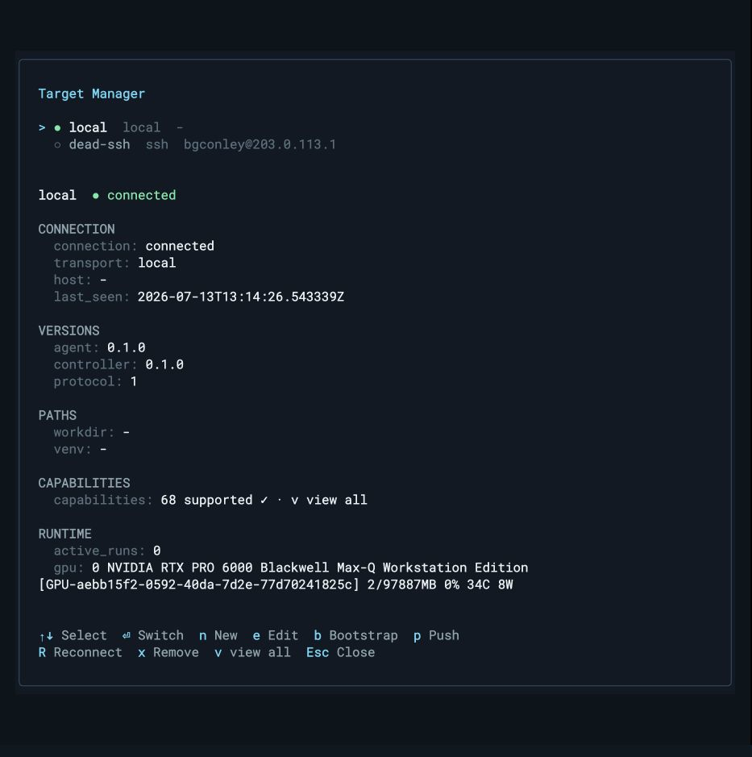

### Add or bootstrap an SSH target

The supported one-command path is:

```bash
vela targets bootstrap gpu-node --host user@gpu-host --install
vela targets test gpu-node
vela targets use gpu-node
```

Use `--ssh-key`, `--workdir`, or `--venv` when discovery cannot infer them. Drop
`--install` when Vela already exists on the target. `bootstrap` writes the
controller registry entry and then performs a real handshake. If that handshake
fails, the entry remains available to repair, retest, or remove; success is not
reported until the handshake passes.

For an already-provisioned host, register it without installation:

```bash
vela targets add gpu-node --host user@gpu-host \
  --workdir /srv/vela --venv /srv/venvs/vela
vela targets test gpu-node
```

Target selection precedence is explicit `--target`, then `VELA_TARGET`, then the
saved default from `targets use`, then `local`. A profile's YAML `target:` field
records its intended home; it does not reroute a command.

### Safe connection failure

Target switching is asynchronous. A slow or dead SSH connection displays a busy
state while the dashboard and Target Manager remain usable.

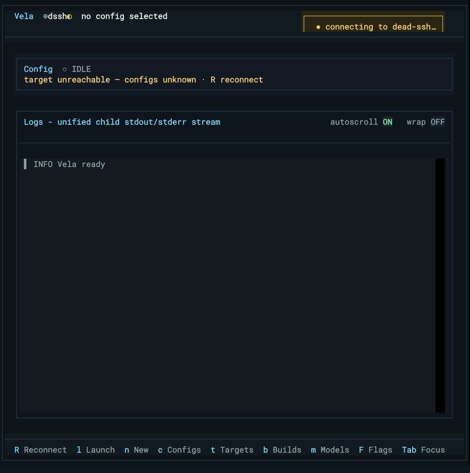

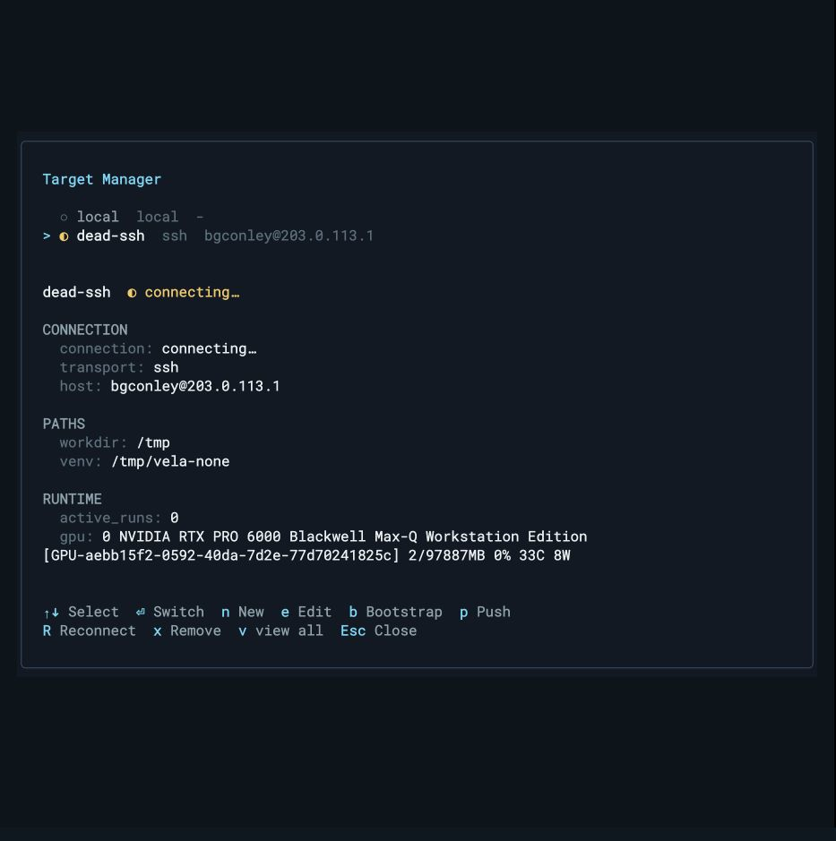

Press Escape, select a known-good target, or use `R` to reconnect. Vela discards
the stale connection result rather than applying it to the newly selected
target.

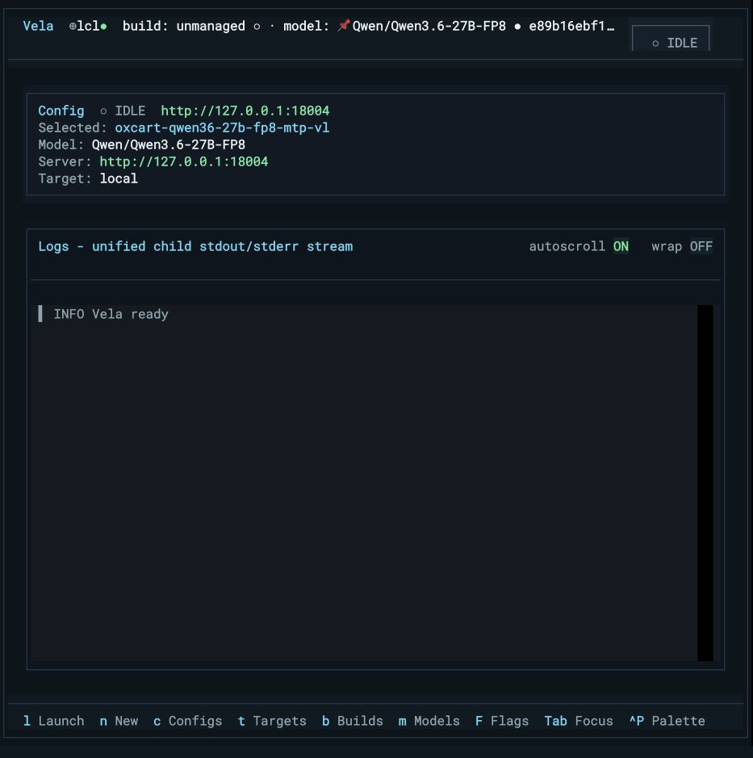

If the banner says `AGENT_UNREACHABLE`, `AGENT_NOT_INSTALLED`,
`AGENT_VERSION_MISMATCH`, or `AGENT_AUTH_REQUIRED`, use the matching section in
[Troubleshooting](troubleshooting.md). Do not weaken SSH host verification to
make a red banner disappear.

### Remove or change a target

```bash
vela targets list
vela targets use --clear
vela targets remove gpu-node
```

The implicit `local` target cannot be overridden or removed. Removing a
controller registry entry does not uninstall Vela or delete target data.

## Deployment profiles

### Select a profile

Press `c` to open Config Picker. It shows the profile's target, runtime, model,
build, and endpoint before selection.

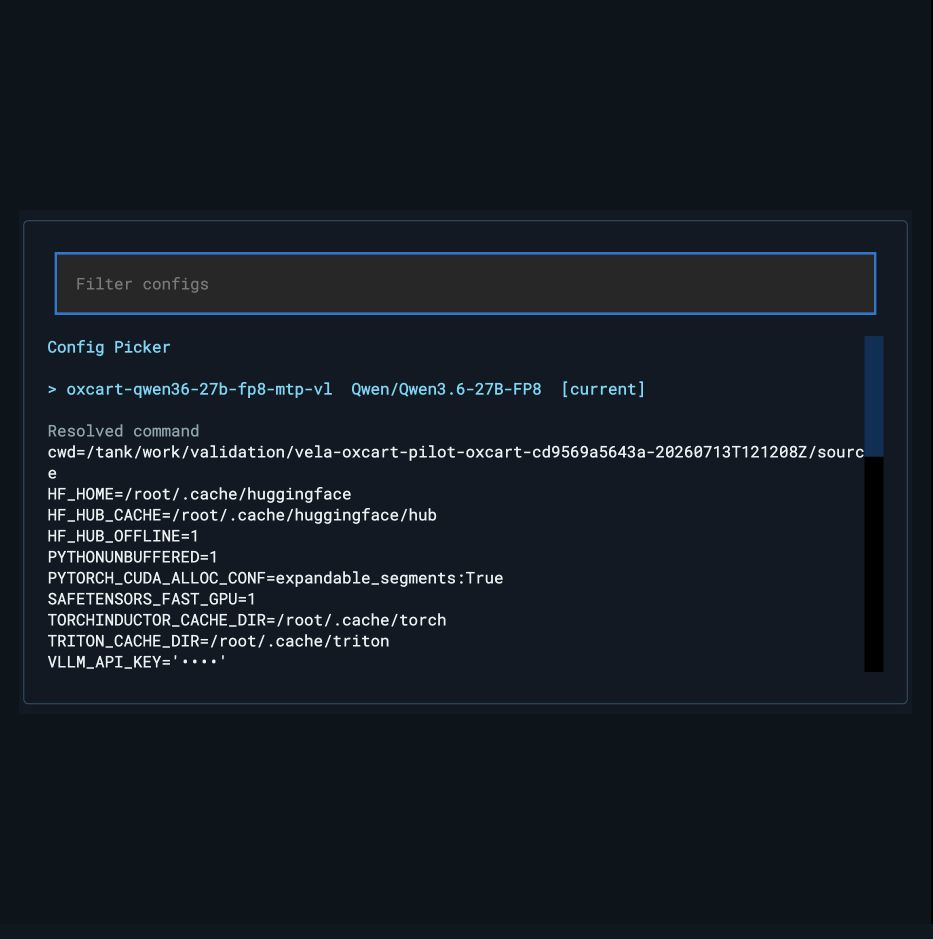

From the CLI:

```bash
vela list --target gpu-node
vela run my-profile --preview --target gpu-node
```

Preview resolves the target-side model/build identity and prints the scrubbed
command without launching anything. Use it before changes and in code review.

### Clone instead of mutating a proven profile

Cloning is the safest starting point for a port, model, or performance variant.
Vela discloses which runtime identities it regenerates, such as Docker container
name, while preserving the source profile.

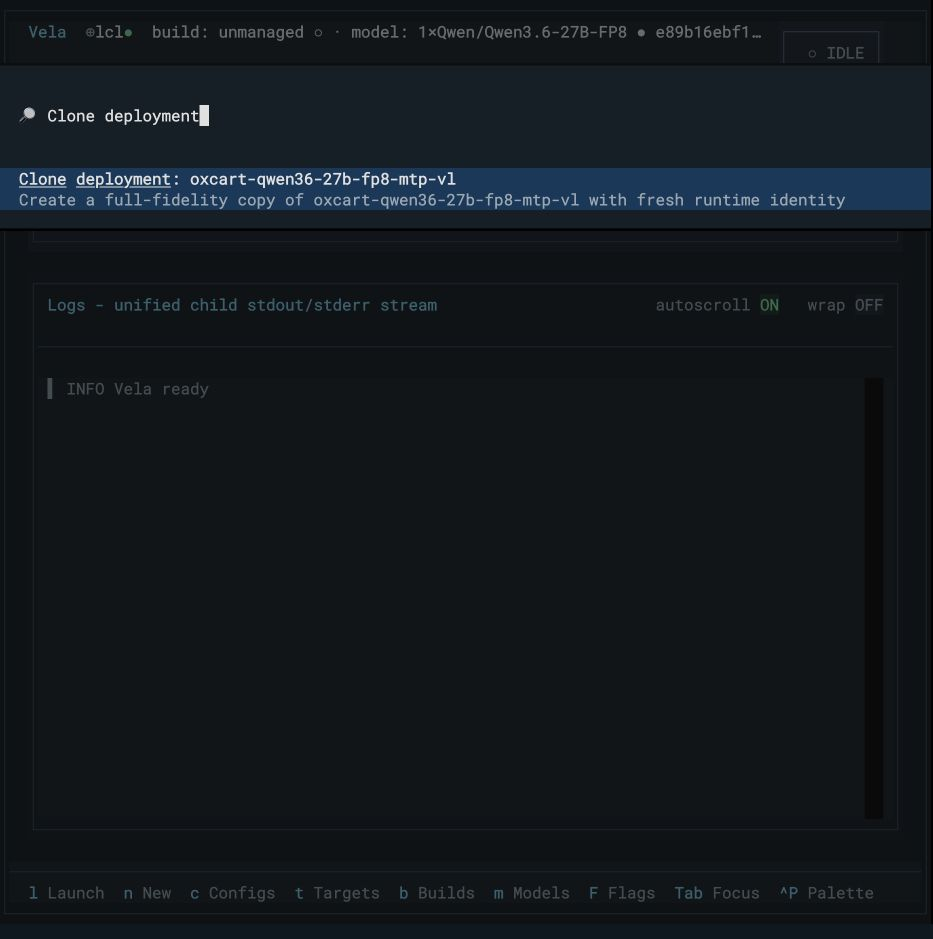

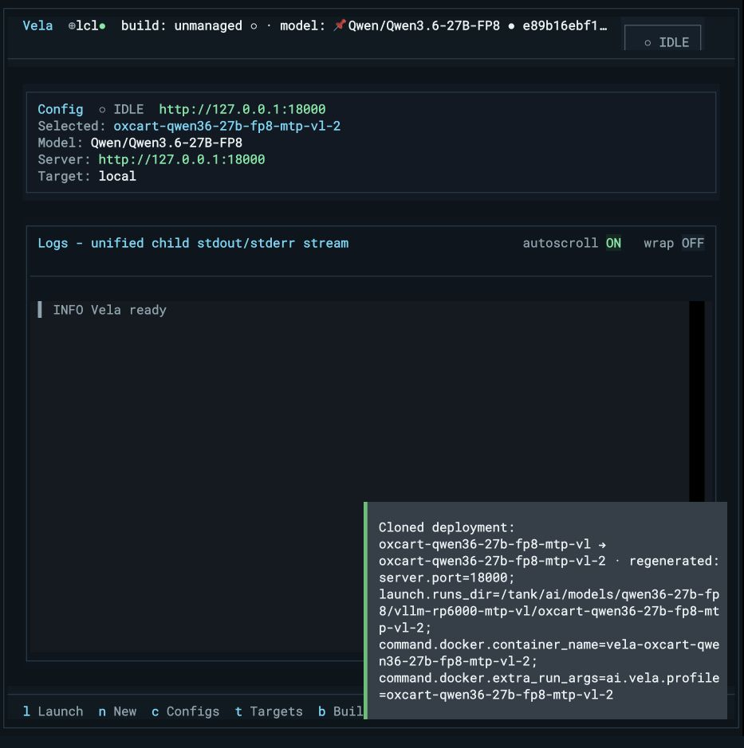

```bash
vela deploy clone proven-profile experiment-a \
  --target gpu-node \
  --set server.port=18005 \
  --set engine.gpu_memory_utilization=0.90
vela run experiment-a --preview --target gpu-node
```

### Edit, lint, export, and delete

```bash
# Non-interactive, target-side edit.
vela deploy edit experiment-a --target gpu-node \
  --set engine.max_model_len=32768 --dry-run

# Open with $EDITOR, lint, then write back only when valid.
vela config edit experiment-a --target gpu-node

# Validate a local YAML file without launch.
vela config lint ./my-profile.yaml --target gpu-node

# Export a target-local standalone Docker wrapper.
vela deploy export experiment-a --target gpu-node \
  --output /tmp/experiment-a.sh

# Destructive actions require confirmation.
vela deploy delete experiment-a --target gpu-node --yes
```

Pass `--configs-dir` when the destination must be deterministic. Without it,
target-side writes use the target process's config directory, which can differ
from the controller's working directory.

### Recover from a duplicate name

Saving never silently overwrites. If a name already exists, the wizard returns
to the editable Target step and keeps the rest of the draft.


Choose a new name and review again; the resolved identity is recomputed before
save.


Use CLI `--overwrite` only when replacement is intentional and reviewed.

### Move configs between controller and target

```bash
vela config push ./profile.yaml --target gpu-node --configs-dir /srv/vela/configs
vela config pull profile --target gpu-node --output ./profile.yaml
```

`push` refuses an existing target file unless `--overwrite` is present. `pull`
never causes a launch. For config discovery order and schema validation, see
[Configuration](configuration.md).

## Launch, monitor, and control a run

### Preflight and launch

Before launch:

```bash
vela doctor --target gpu-node
vela run my-profile --preview --target gpu-node
```

In the TUI, select the profile and press `l` or Enter. The agent validates host
scope, port availability, available build/image identity, model cache policy,
disk headroom, exposure, and vLLM flag compatibility before it creates a process
or container. New wizard-composed profiles require an immutable build ID or
Docker digest. Older hand-authored process profiles may still fall back to
`vllm` on the target `PATH`; Vela warns that this is mutable rather than
pretending it is reproducible.

For a pinned model that must already be local:

```bash
vela run my-profile --target gpu-node --require-cached
```

### Understand lifecycle states

The top-right badge and Config card agree on the lifecycle:

| State | Meaning | Operator action |
| --- | --- | --- |
| `IDLE` | Profile selected; no owned run | Launch or edit |
| `STARTING` | Process/container created; startup observed | Watch phases and logs |
| `READY` | Health and model endpoint gate passed | Send traffic |
| `DEGRADED` | Process exists but health is not honest | Inspect banner/logs |
| `ERROR` | Launch or preflight failed | Follow remediation; retry only after correction |
| `STOPPED` | Terminal, intentionally stopped or exited | Relaunch or inspect artifacts |

The phase display is derived from scrubbed startup logs. It is useful progress,
but only the green READY gate authorizes traffic.

### Work with logs

- `/` searches the current log.
- `f` filters levels/categories.
- `p` pauses rendering without pausing the server.
- `w` toggles wrap.
- `g` and `G` jump to top and bottom.

Durable logs are scrubbed before they cross the agent boundary or reach disk.
Transient carriage-return progress frames can appear live without being stored.

Detached CLI runs print a run ID. Use that exact ID for unambiguous operations:

```bash
vela runs list --target gpu-node
vela logs RUN_ID --target gpu-node --lines 200
vela logs RUN_ID --target gpu-node --follow
```

### Verify the endpoint

READY includes the target-reachable URL. From a shell that can reach it:

```bash
curl --fail http://127.0.0.1:8000/health
curl --fail http://127.0.0.1:8000/v1/models | python -m json.tool
```

If the server requires a key, send it from an environment variable rather than
placing a literal secret in YAML or shell history:

```bash
curl --fail \
  -H "Authorization: Bearer $VLLM_API_KEY" \
  http://127.0.0.1:8000/v1/models
```

For a bounded launch/READY/model-list/stop gate, use:

```bash
vela smoke my-profile --target gpu-node --require-cached
```

### Stop, kill, or restart

Prefer graceful Stop (`s`): the agent verifies process/container identity, sends
the configured stop action, waits for shutdown, and records a terminal status.

Use Kill (`K`) only when graceful stop cannot complete. The confirmation dialog
makes the stronger action explicit. Restart (`r`) stops the verified current run
and launches the same saved profile again.

From the CLI:

```bash
vela stop RUN_ID --target gpu-node
vela stop RUN_ID --target gpu-node --kill
```

After a detached CLI stop, verify that exact run ID is absent from the active
detached inventory. Attached TUI runs are never listed there; use the TUI and
durable run artifact for their terminal state. In either mode, verify the
endpoint is closed from a shell in the target's network context:

```bash
vela runs list --target gpu-node
curl --fail http://127.0.0.1:8000/health  # expected to fail after stop
```

## Models

Press `m` for Model Manager. It distinguishes source, immutable revision,
cache state, quantization metadata, size, and profiles that use the entry.

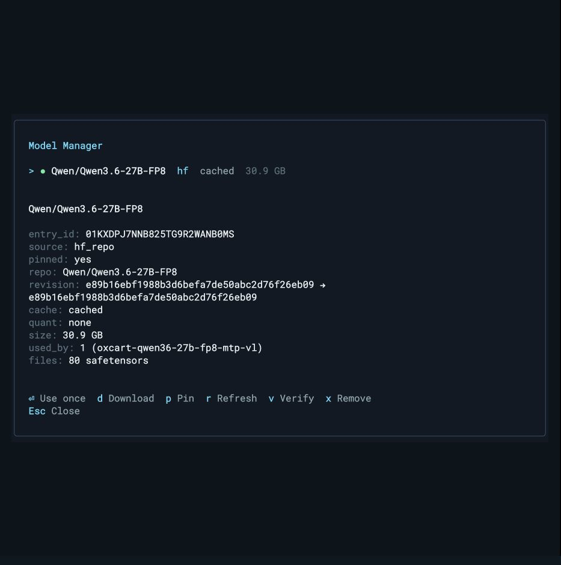

### Pin, download, and verify

```bash
vela model pin Qwen/Qwen3.6-27B-FP8 \
  --target gpu-node \
  --revision main
vela model download Qwen/Qwen3.6-27B-FP8 --target gpu-node
vela model verify Qwen/Qwen3.6-27B-FP8 --target gpu-node
vela model inspect Qwen/Qwen3.6-27B-FP8 --target gpu-node
```

Pin resolves an upstream revision to immutable metadata. Weights remain in the
target's Hugging Face cache. For gated models, accept the upstream terms and set
`HF_TOKEN` on the target; Vela never stores the token in the registry.

`model verify --deep` is a two-pass integrity workflow. The first deep run
establishes a baseline and warns; a later deep run compares content against it.

### Use once

Enter on a Model Manager entry applies a transient **Use once** override to the
next launch. It does not rewrite the selected profile and is consumed by that
launch.

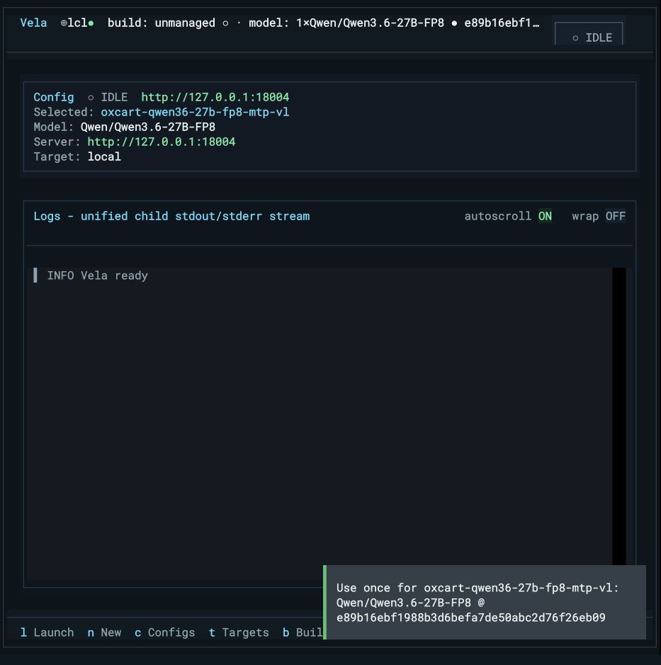

For reproducible future launches, clone/edit the profile and save the model pin
instead of relying on Use once.

### Adopt or remove

```bash
vela model adopt /srv/models/local-model \
  --target gpu-node --display-name local-model
vela model remove local-model --target gpu-node --yes
```

Model removal refuses live usage. `--force` can override config-pin protection,
but it cannot override a verified live run.

See [Builds and models](builds-and-models.md) for revision divergence, cache
learning, manifest verification, and disk-headroom behavior.

## Builds

Press `b` for Build Manager. An empty target offers New and Adopt without
pretending a build exists.

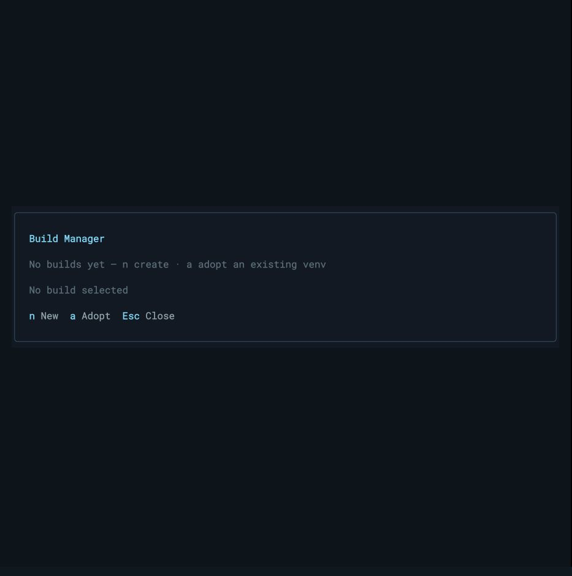

Docker profiles do not select a target venv; their immutable image digest is the
runtime identity. New process profiles select a managed build or explicit
executable. Compatibility profiles with neither can still use target `vllm` on
`PATH`, with an explicit reproducibility warning.

```bash
vela build doctor --target gpu-node
vela build add --target gpu-node --method pip \
  --spec 'vllm==0.11.2' --label vllm-0-11-2
vela build inspect vllm-0-11-2 --target gpu-node
vela build verify vllm-0-11-2 --target gpu-node
vela build select vllm-0-11-2 --target gpu-node
```

Use `adopt` for an existing venv, `repair` to regenerate launcher files without a
reinstall, and `build run BUILD -- COMMAND...` for a target-side diagnostic:

```bash
vela build run vllm-0-11-2 --target gpu-node -- \
  python -c 'import vllm; print(vllm.__version__)'
```

Removal has no force override and refuses live or config-pinned builds:

```bash
vela build remove vllm-0-11-2 --target gpu-node --yes
```

See [Builds and models](builds-and-models.md) for all install methods and
ownership rules.

## Flags and presets

Press `F` for Flag Manager. Vela separates:

- **Modeled** flags it understands and can validate.
- **Passthrough** flags deliberately forwarded as written.
- **Unknown to build** flags not advertised by the selected process build.

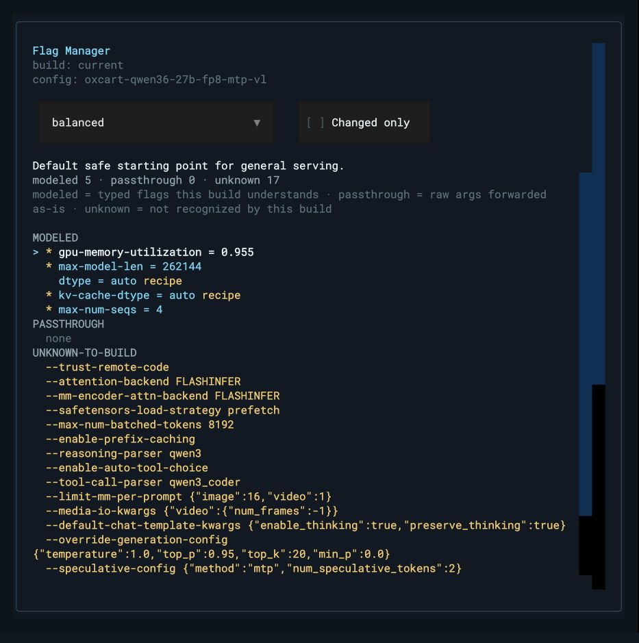

The right-hand provenance label distinguishes schema defaults, presets, recipes,
profile values, and operator overrides. `d` resets a field to schema default;
`p` resets to the chosen preset/recipe; `x` filters to changed fields; `Ctrl+S`
saves.

Process runtime probes the selected vLLM build's `serve --help`. Docker runtime
uses Vela's compatibility profile because the host executable is not the image
executable. Treat machine-specific recipes as proven local policy, not universal
presets.

## Failure handling

Preflight failures should be specific, visible, and non-destructive. A profile
scoped to another hostname fails before any container or GPU action.

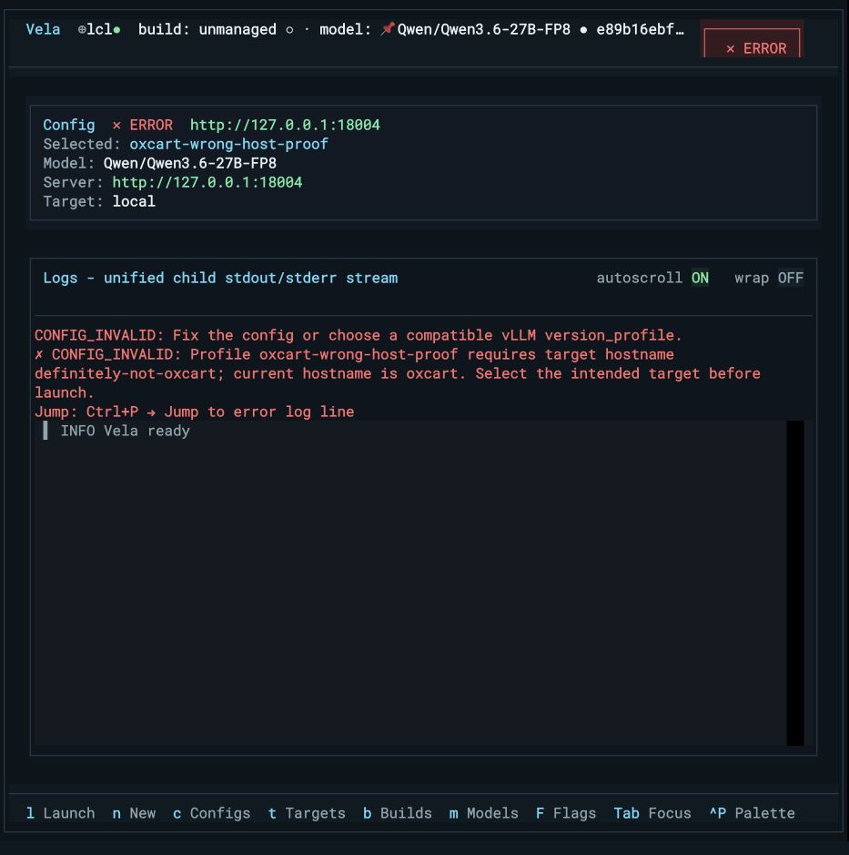

The UI remains responsive after failure; Help, Target Manager, Config Picker,
and Quit still work.

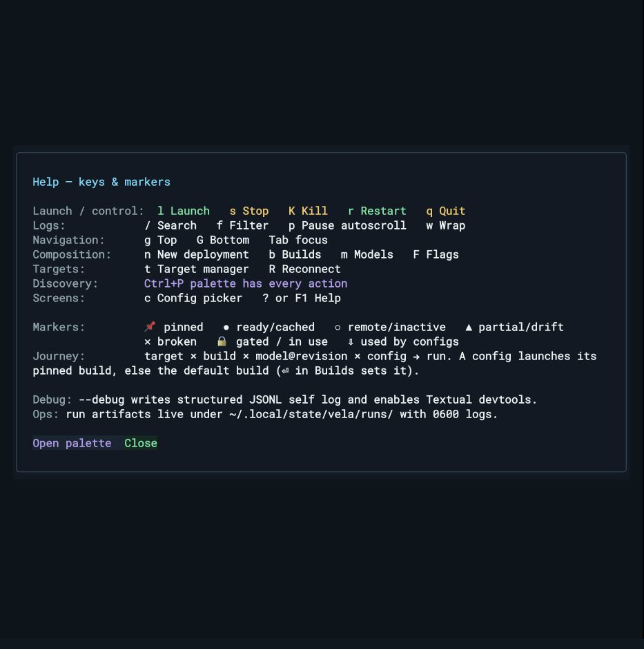

Recovery pattern:

1. Read the symbolic error kind and detail.
2. Open `?` Help or [Troubleshooting](troubleshooting.md).
3. Correct the target, profile, cache, token, port, or runtime identity.
4. Run Preview or Doctor again.
5. Relaunch only after the preflight is green.

Do not use `--force` as a generic recovery tool. It exists for a reviewed
preflight exception and does not disable live-run identity protections.

## Agent daemon

The implicit local target normally uses a Unix-socket daemon. SSH targets
normally run `vela agent connect` over the SSH stdio stream and do not need a
shared remote daemon.

```bash
vela agent status --json
vela agent restart --json
vela agent status --target gpu-node --json
```

Without `--target`, `agent status` reports the local socket daemon. With
`--target`, it opens the configured transport and runs a target diagnostic
(host, paths, toolchain, GPUs, auth, and active state); it does not inspect a
shared remote daemon.

Restart an idle local daemon after upgrading Vela so its revision matches the
controller. Never restart blindly while another operator owns active runs; check
`vela runs list --target local --json` first.

For a shared-user host, install a strong capability token on controller and
target:

```bash
vela agent gen-token --install --target gpu-node
```

See [Configuration](configuration.md), [Environment and paths](environment.md),
and [Agent RPC](agent-rpc.md) for socket precedence, authentication, and the
controller/agent wire boundary.

## Run artifacts and retention

The default target-local run directory is:

```text
$XDG_STATE_HOME/vela/runs
# fallback: ~/.local/state/vela/runs
```

A run can include a scrubbed log, event NDJSON, sidecar JSON, manifest, and exit
status. Do not edit sidecars to make a stale process appear owned; the agent
re-verifies the live identity before every signal.

Preview pruning before deletion:

```bash
vela runs prune --dry-run
vela runs prune --keep 20 --older-than-days 7
```

`runs prune` is controller-local filesystem maintenance. It does not accept a
target and never removes an identity-verified live run.

## Shift checklists

### Before launch

- Correct target selected and handshake green.
- Profile preview matches expected model, revision, build/image, port, exposure,
  mounts, and extra args.
- Model cached when policy requires it.
- No conflicting active run, port, or container.
- API-key and token handling reviewed against the current limitations in
  [Environment and paths](environment.md#api-key-limitation); no literal secret
  committed to YAML.

### Before sending traffic

- Badge is READY, not merely STARTING.
- `/health` succeeds from the intended client network.
- `/v1/models` exposes the expected served model ID.
- Exposure and firewall/reverse-proxy policy match the bind.

### After stop

- UI shows the terminal state; `runs list` reports that no matching active
  detached run remains.
- Endpoint no longer answers.
- Owned process/container and GPU allocation are gone.
- Durable run artifacts contain the expected closure.

## Related documentation

- [First real deployment tutorial](tutorials/first-deployment.md)
- [Getting started and local fake-child demo](getting-started.md)
- [Complete CLI reference](cli-reference.md)
- [Configuration schema](configuration.md)
- [Docker runtime](docker-runtime.md)
- [Builds and models](builds-and-models.md)
- [Troubleshooting by symbolic error](troubleshooting.md)
