# First real deployment: illustrated tutorial

[Documentation home](../index.md) · [Getting started](../getting-started.md) ·
[Operations](../operations.md) · [Troubleshooting](../troubleshooting.md)

This tutorial follows one deployment from an empty Vela dashboard through
target selection, immutable runtime and model resolution, field-by-field Review,
save-only proof, cold reload, a real READY gate, endpoint verification, and an
operator-owned Stop.

Every screenshot is a byte-for-byte copy of the checksummed July 13, 2026 live
workflow at runtime source
`cd9569a5643a41b53e0ee4d133b0b6d2d616d9d7`. Oxcart acted as both controller
and target through the implicit `local` transport. The example profile served a
real Qwen3.6 27B FP8 vision model in a digest-pinned Docker container.

The Oxcart recipe, paths, port, image digest, model revision, GPU settings, and
non-secret `EMPTY` lab API-key sentinel are evidence for that exact host—not
defaults to copy to another machine. On your own target, use its validated
recipe or explicitly reviewed runtime settings.

## What you will accomplish

By the end, you will have proved that:

1. the selected agent is authoritative for the intended target;
2. the saved profile contains an immutable build/image and model revision;
3. Review exposes provenance, flags, mounts, redaction, and the resolved command;
4. **Save** writes a profile but starts no workload;
5. a cold controller session restores the same profile identity;
6. READY is backed by health and model-identity checks; and
7. Stop produces an intentional terminal closure and releases the endpoint.

If you only want a no-GPU evaluation, use the
[`fake-child` walkthrough](../getting-started.md#try-the-no-gpu-demo-from-a-clone).
That exercise proves Vela's supervision path but not a real model, container,
GPU, or cache.

## Before you begin

You need:

- Vela installed on the controller and a compatible agent on the target;
- a target that can actually run the chosen process build or Docker image;
- enough model-cache and image disk space;
- a terminal at least 80 columns wide (100 or more is easier for Review);
- access to the selected model, including target-side `HF_TOKEN` for a gated
  repository; and
- no unrelated active run on the port, container name, or GPUs you intend to use.

Read [Environment variables and storage paths](../environment.md) before using
credentials. In particular, Vela does not yet have an end-to-end target-side
secret-reference resolver for `server.api_key`; keep real API authentication in
an approved reverse proxy/firewall design rather than literal YAML.

### 1. Check the controller and target

For an existing target:

```bash
vela version
vela doctor --target gpu-node
vela targets test gpu-node
```

If Vela itself runs on the GPU host, substitute `local`. Here, `local` means the
host running the Vela agent—not the laptop from which you opened an SSH session.

To provision a new SSH target instead:

```bash
vela targets bootstrap gpu-node --host user@gpu-host --install
vela targets test gpu-node
```

`bootstrap` records the target and then handshakes it. A failed handshake can
leave the entry registered so you can repair, retest, or remove it.

### 2. Open the TUI

```bash
vela --target gpu-node
```

Use `vela` with no `--target` when the saved default or implicit `local` target
is correct. An installation with no profiles shows an honest empty state rather
than selecting fabricated data:


From here, `?` opens Help, `Ctrl+P` opens the command palette, `t` opens Target
Manager, and `n` starts New Deployment.

## Create the deployment

Press `n`. The wizard has six visible steps: **Target**, **Runtime**, **Model**,
**Customize**, **Review**, and **Save & Smoke**. `Ctrl+N` moves forward,
`Ctrl+B` moves back, `Ctrl+S` composes Review, and Escape cancels without saving.

### Step 1 of 6: Target

1. Open the Target selector.
2. Choose the intended target.
3. Wait for the connected line; do not continue on a stale or connecting target.
4. Confirm the hostname and agent version shown beneath the selector.

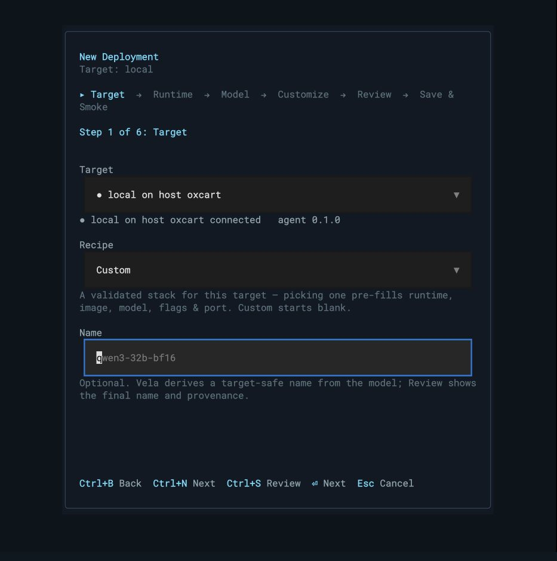

In the evidence run, `local on host oxcart` is correct because the controller
was running on Oxcart. A workstation controller would normally show a named SSH
target instead.

#### Choose a recipe or Custom

A recipe is a host-validated starting shape. It can fill runtime, image, model,
flags, cache mounts, port, exposure, and required hostname. Select a recipe only
when it is offered for the current target and matches the workload you intend.

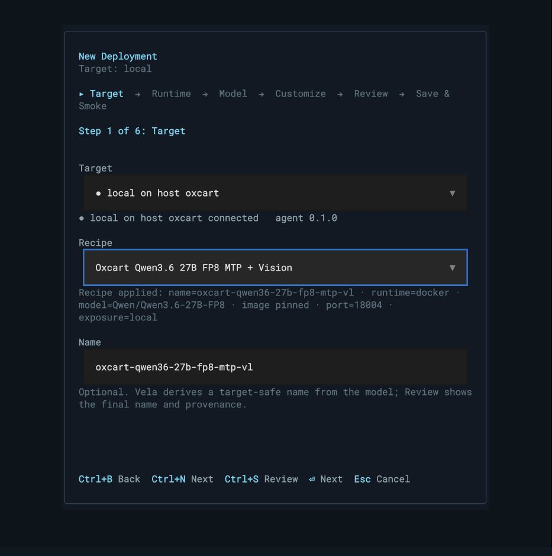

The banner states what the recipe supplied. In this run it derived
`oxcart-qwen36-27b-fp8-mtp-vl`, Docker runtime, the Qwen model, a pinned image,
port `18004`, and local exposure.

Switching from a recipe back to **Custom** clears recipe-derived values and
restores the operator's earlier draft. This prevents invisible recipe state from
leaking into a supposedly custom profile:

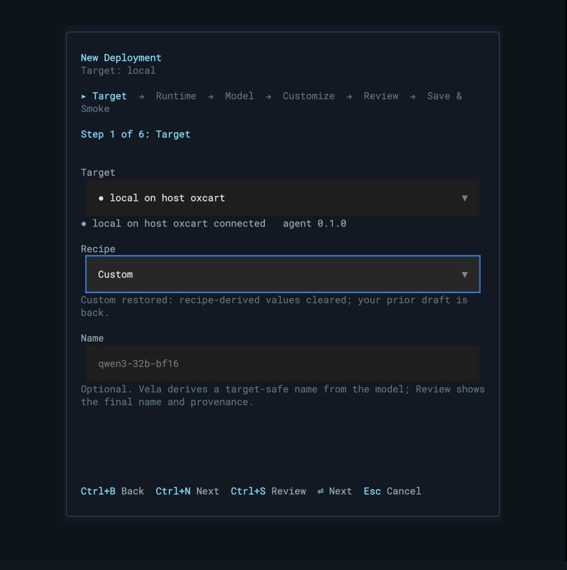

For this tutorial, reselect the validated recipe and continue.

### Step 2 of 6: Runtime

The runtime answers “what exact software environment will execute vLLM?”

- **Docker** profiles created by the wizard require a full
  `repository@sha256:<64 hex>` image digest.
- **Process** profiles created in the wizard require a selected managed build.
  The option-driven CLI can also compose an explicit executable, but a managed
  build ID is the reproducible interactive path.

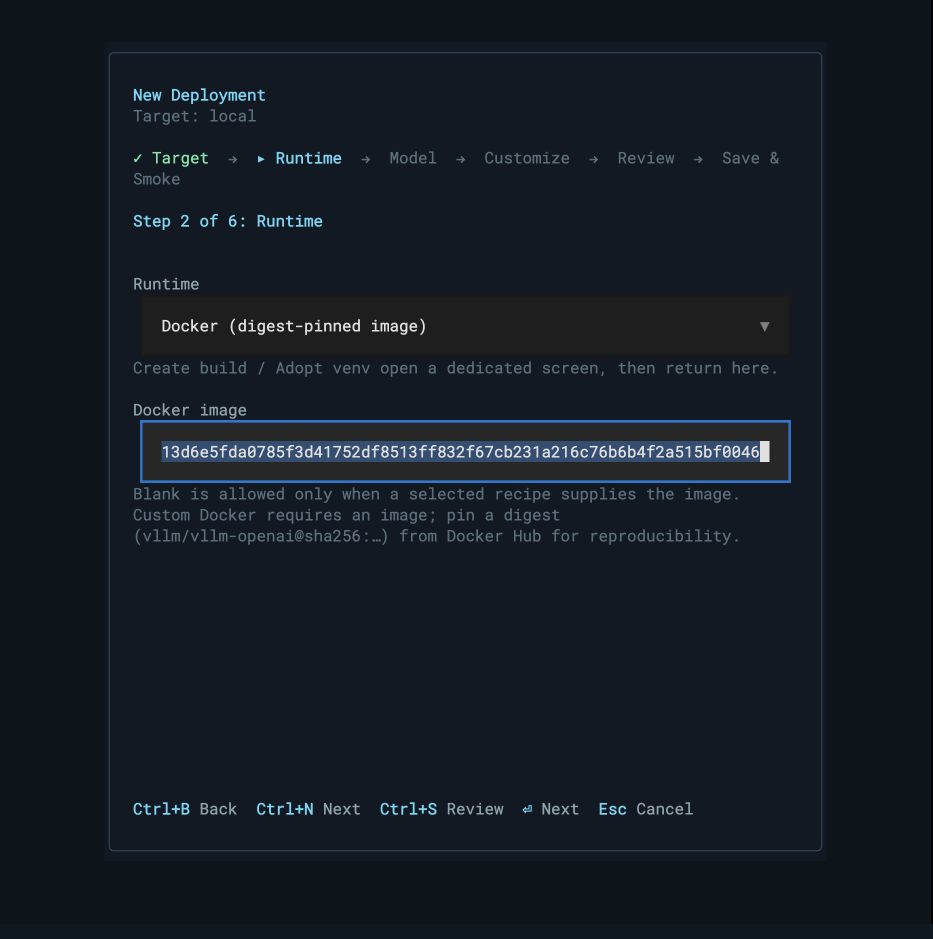

Verify all of the following before continuing:

- the runtime family is intentional;
- the image contains `@sha256:` and a full digest, not a tag or abbreviation;
- the image or build exists on this target; and
- a custom Docker image was validated for this GPU/CUDA/vLLM stack.

Do not copy the Oxcart digest merely because it appears in this screenshot. The
image and Blackwell backend choices came from a target-specific validated recipe.

### Step 3 of 6: Model

The model step can use an existing registry pin, pin a Hugging Face repository,
or adopt a target-local model path. A recipe may require a specific repository
and immutable commit.

If no matching pin exists, the screen explains the exact requirement instead of
silently using a mutable branch:

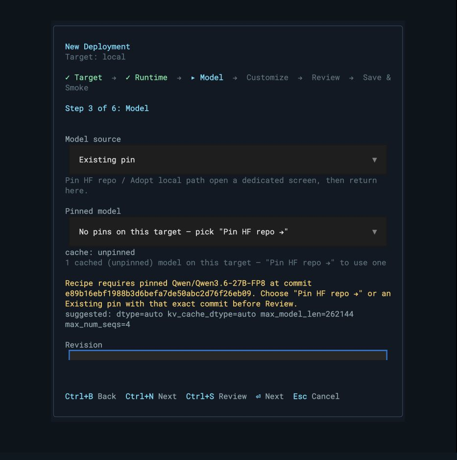

Choose **Pin HF repo**. In the dedicated screen:

1. leave Source as **HF repo**;
2. enter the `org/repo` ID;
3. optionally choose a display name;
4. enter the required revision or full commit SHA; and
5. submit the pin.

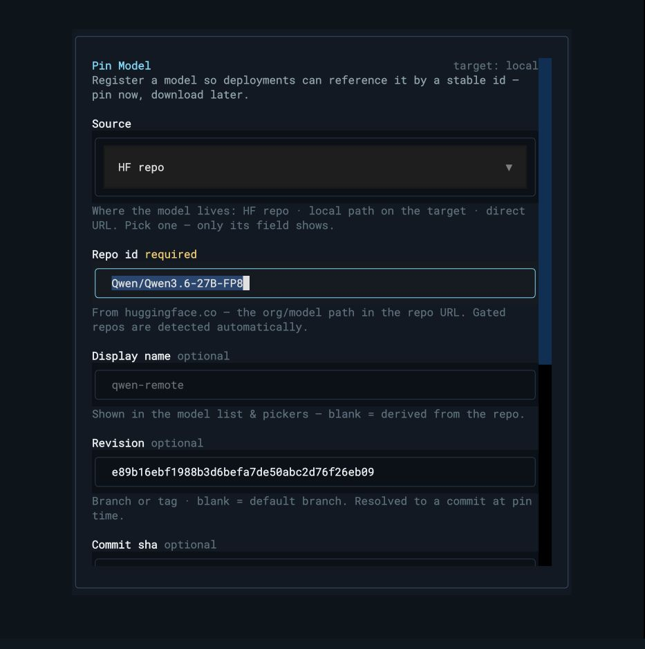

An online pin resolves branch/tag intent to a commit and records gating and file
metadata. Pinning does not necessarily download weights. If the profile requires
a cached model, download and verify it on the target before launch:

```bash
vela model download MODEL_REF --target gpu-node
vela model verify MODEL_REF --target gpu-node
```

On return, the wizard confirms the pin and retains the completed earlier steps:

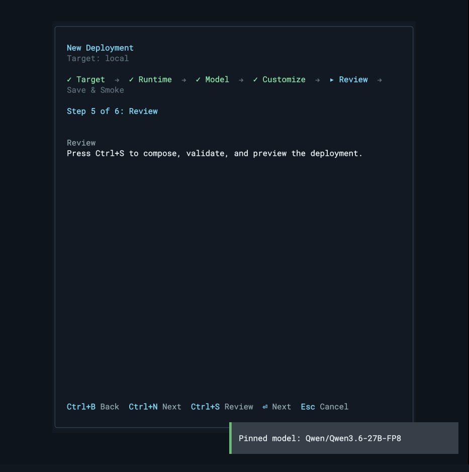

Check that the selected registry entry, repository, revision, and cache state are
the ones you intended. A display name alone is not immutable identity.

### Step 4 of 6: Customize

Customize only the values that must differ from the recipe or schema defaults.
The most important review points are:

- server host, port, and exposure;
- tensor/pipeline parallel sizes and visible GPUs;
- model length, dtype, quantization, and KV-cache settings;
- cache and compile-cache mounts;
- required hostname and cached-model policy;
- raw `extra_args`; and
- environment values, with no literal credentials.

Use the preset controls rather than retyping a known target policy. If you edit
raw flags, verify their spelling against the selected runtime. The Review screen
will show every modeled and passthrough flag with provenance before anything is
saved.

### Step 5 of 6: Review

Press `Ctrl+S`. At this point `Ctrl+S` means **compose, validate, and preview**;
it does not yet write the profile. Review starts with the resolved identity:

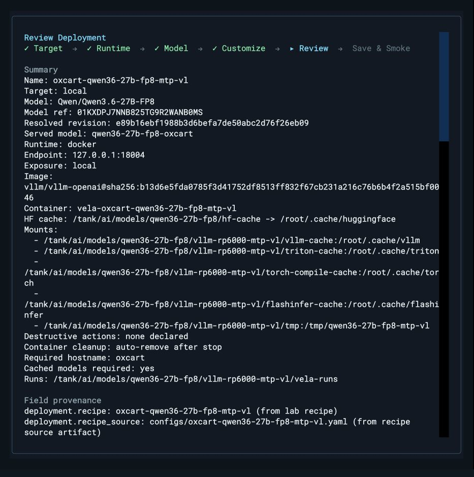

Read the Summary top to bottom. For this evidence profile it shows:

- target `local` on the already verified Oxcart host;
- model registry entry and resolved 40-character commit;
- served model ID `qwen36-27b-fp8-oxcart`;
- Docker runtime and full image digest;
- container name, cache, and compile-cache mounts;
- local endpoint `127.0.0.1:18004`;
- `required_hostname: oxcart`;
- cached-model policy and run-artifact directory; and
- no declared pre-launch destructive action.

#### Audit field provenance

Continue scrolling. Every important field states whether it came from the lab
recipe, selected model pin, schema default, or operator input:


This is where you catch a correct-looking value from the wrong source. A model
revision should come from the resolved registry pin; a target-tuned image or
mount should come from the target recipe or an explicit reviewed override.

#### Audit flags

Review the modeled fields and raw passthrough arguments. Long JSON-like flag
values should render literally and remain readable:

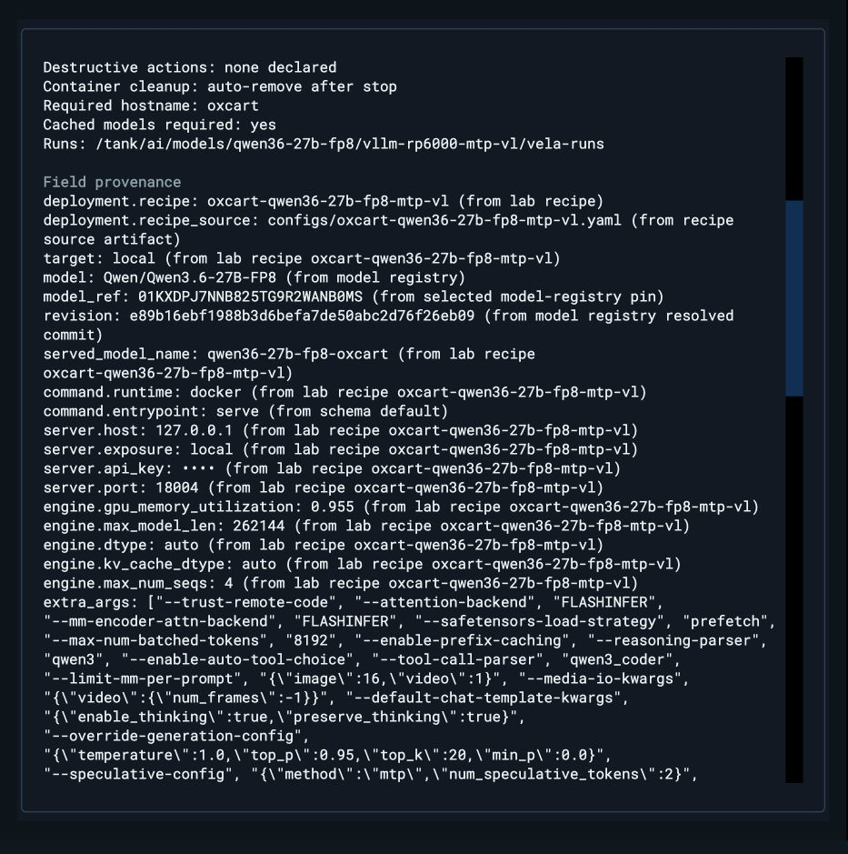

Unknown-to-build or compatibility warnings must be resolved before save. Do not
use `--force` as a general way to turn red preflight into green documentation.

#### Confirm redaction

Secret-looking fields and environment values must be masked in Review and the
command preview:

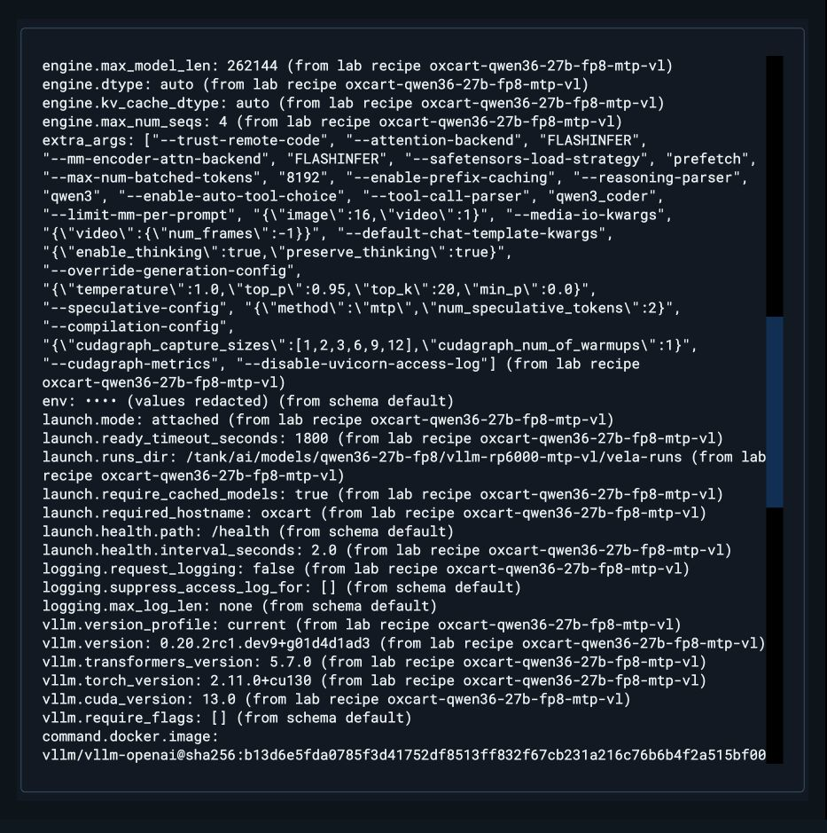

Redaction prevents display leakage; it does not make literal secrets safe to
store. If you see a real credential, cancel and fix the source rather than
continuing.

#### Inspect the resolved command

The Resolved command pane contains the scrubbed target-side launch shape Vela
has composed. Scroll inside that pane and inspect the complete command. This
capture shows its working-directory and environment prefix plus the distinct
save controls; it does not show the full Docker invocation:

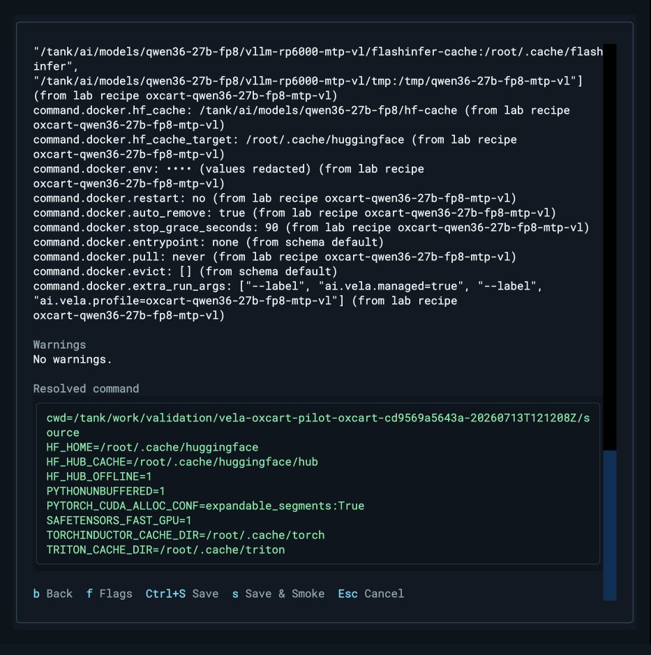

Across the Summary, Flags, and full scrollable command, confirm working
directory, environment, Docker options, image, model, endpoint, mounts, and
flags. The page must say **No warnings** or contain only warnings you understand
and have deliberately accepted.

The bottom of the resolved-command capture keeps **Save** and **Save & Smoke**
visibly distinct.

### Step 6 of 6: Save without launching

Press `Ctrl+S` for **Save**. Do not press `s` yet; that is **Save & Smoke**.

The wizard returns to the dashboard with the profile selected and the lifecycle
still IDLE:

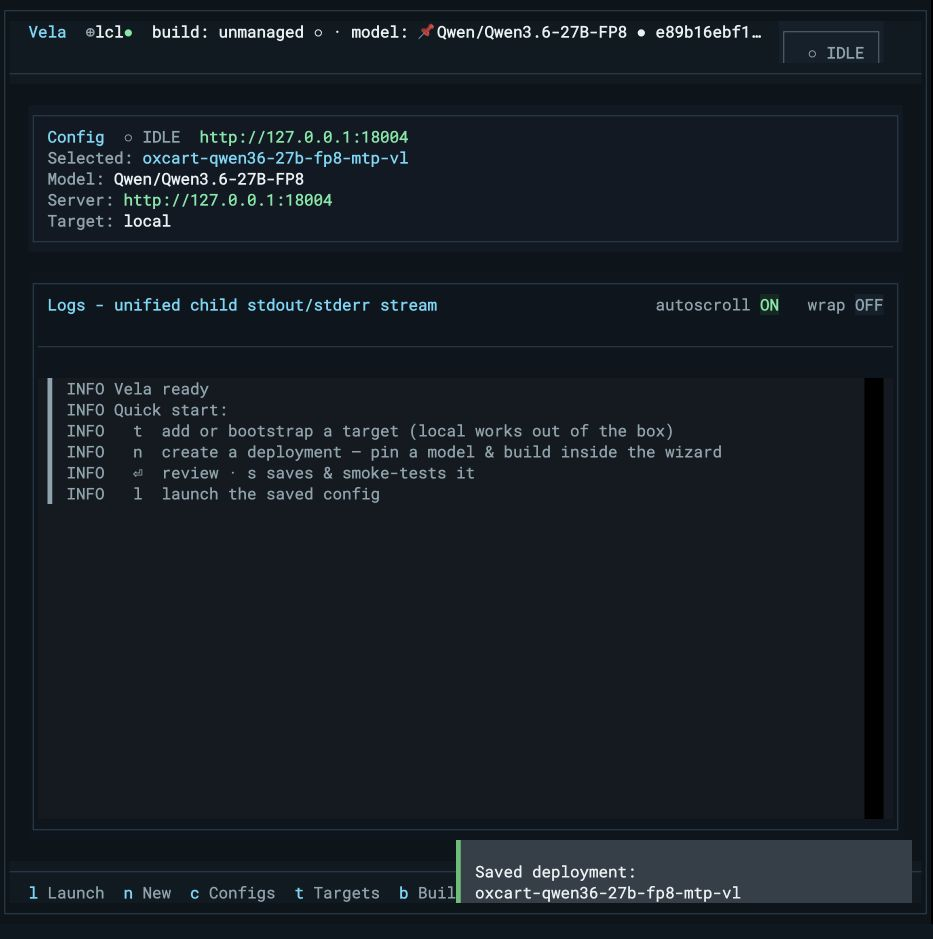

This is an important safety assertion: a saved YAML file is not a process or
container. In the validated workflow, no container existed and port `18004` was
closed after Save.

For an independent textual check:

```bash
vela run PROFILE_NAME --preview --target gpu-node
```

Preview must reproduce the reviewed command while launching nothing.

## Prove cold restore

Cold restore catches state that exists only in controller memory.

1. Confirm the dashboard is IDLE and no run is active.
2. Quit the TUI with `q`.
3. Start Vela again against the same target.
4. If the profile is not already selected, press `c` and select it.

For an idle local socket daemon after a Vela upgrade, you may also run
`vela agent restart` before reopening. Do not restart a shared or active daemon
blindly; SSH targets normally use a transient `agent connect` process anyway.

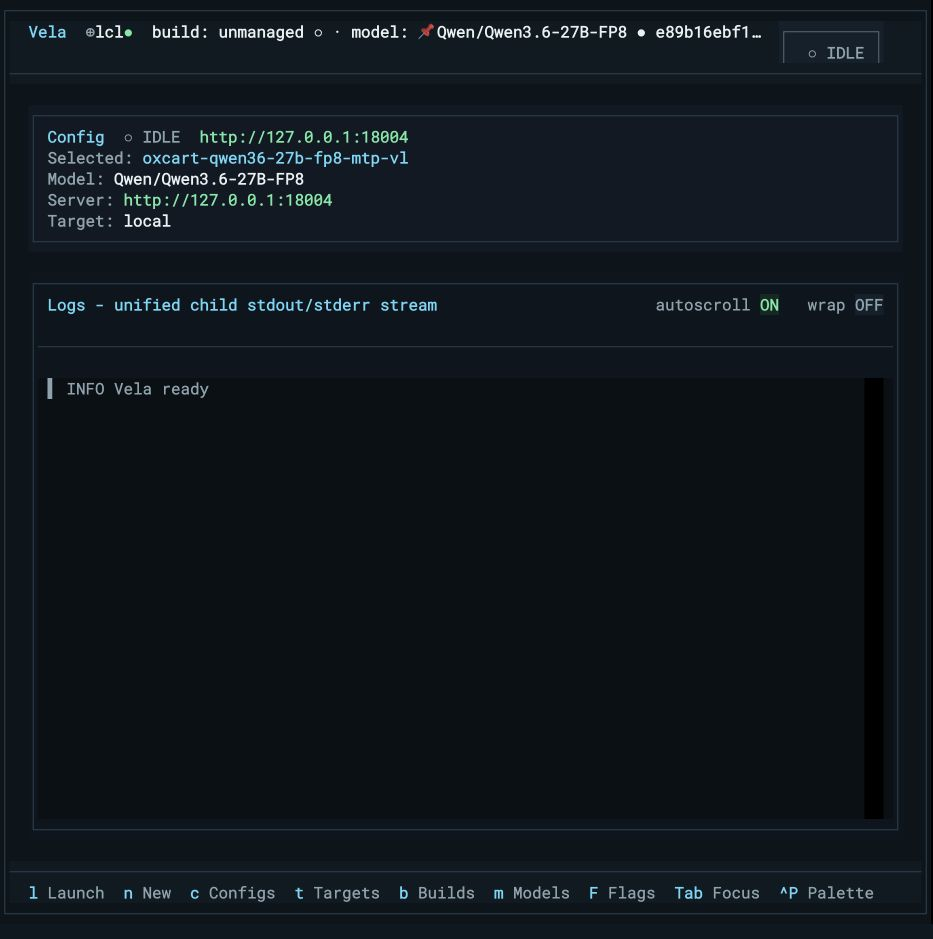

Compare the target, model, revision, served ID, endpoint, and runtime identity to
Review. The reference proof also compared saved YAML, preview, resolved command,
mounts, and flags across two cold launches; only run/container IDs changed.

## Launch and wait for READY

Press `l` or Enter. The lifecycle moves from IDLE to STARTING and the log pane
opens a new run separator:

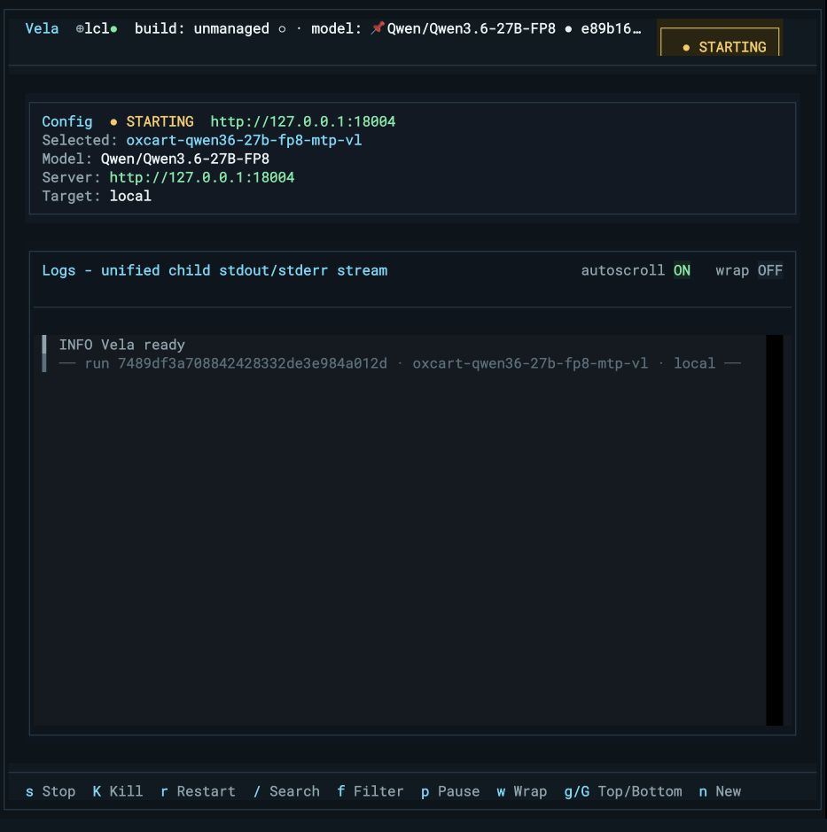

Watch phase progression and scrubbed logs. Large models can spend substantial
time resolving or loading weights; an active progress phase is not READY:

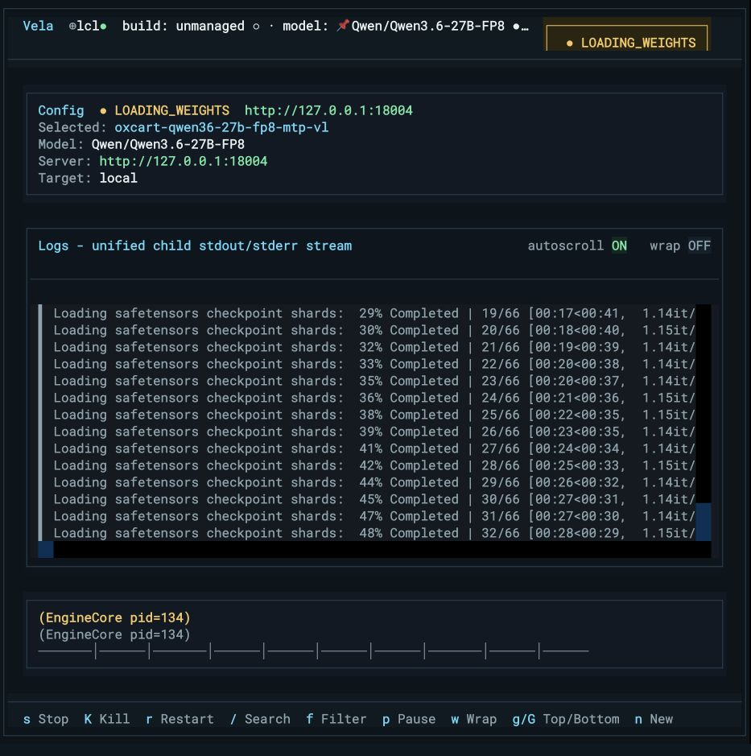

Do not send traffic because a promising log line appeared. Wait until the
top-right badge, Config card, phase timeline, and health/model gate agree on
READY:


If the launch fails, read the symbolic error kind, open `?` Help, and use
[Troubleshooting](../troubleshooting.md). Correct the cause, run Preview or
Doctor again, and only then relaunch.

## Verify the endpoint

Run probes from a shell that can reach the endpoint. For a loopback deployment,
that normally means the target itself or a trusted tunnel.

The exact Oxcart evidence used a non-secret `EMPTY` sentinel inside an isolated
loopback validation lane:

```bash
ENDPOINT=http://127.0.0.1:18004
curl --fail --silent --show-error "$ENDPOINT/health"
curl --fail --silent --show-error \
  -H 'Authorization: Bearer EMPTY' \
  "$ENDPOINT/v1/models" | python -m json.tool
```

The model list contained exactly `qwen36-27b-fp8-oxcart`. The retained proof also
sent a real text request and a 64×32 red/green vision image and received the
expected responses.

Do not copy `EMPTY` to a network-reachable deployment; it is not a credential.
Use the access-control design described in
[Environment: API-key limitation](../environment.md#api-key-limitation).

## Stop cleanly

Press `s` for graceful Stop. Wait for the lifecycle to become STOPPED and for an
explicit operator closure in the log:

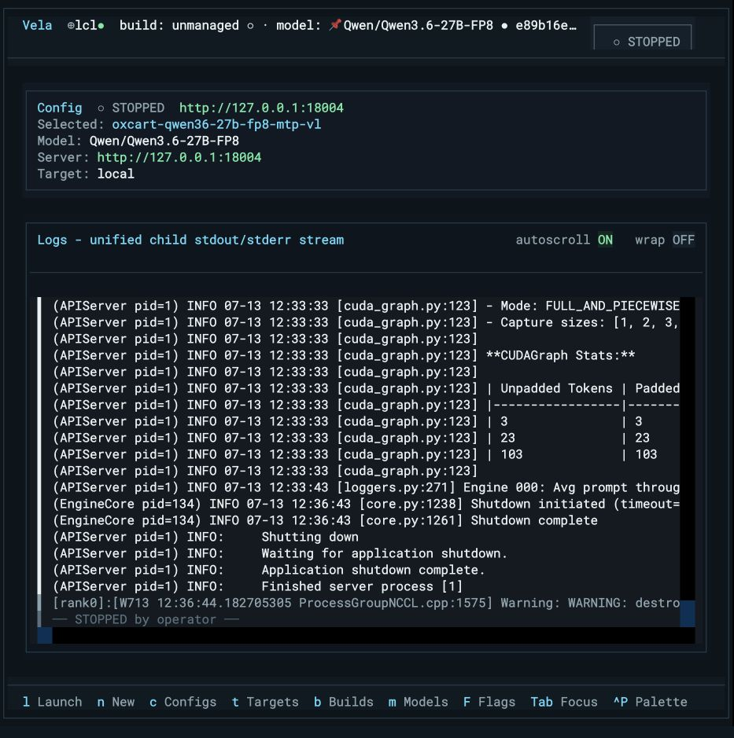

The reference log also shows vLLM's NCCL `destroy_process_group()` shutdown
warning. Every listener, container, process, and GPU-residue gate passed, so the
evidence classifies the result as clean-with-runtime-warning—not warning-free.
Investigate rather than normalize a different shutdown warning.

Then verify the endpoint is gone from the target's network context:

```bash
curl --fail http://127.0.0.1:18004/health  # expected to fail after stop
```

This tutorial's TUI launch was attached. `vela runs list` inventories active
**detached** runs only, so an empty result is not proof of this launch or its
cleanup. The TUI and durable run artifacts retain the terminal STOPPED result.
On the reference target, independent evidence also proved the owned container,
listener, and process absent and the GPU returned to idle.

Use Kill (`K`) only when graceful Stop cannot complete. Vela re-verifies the
owned process/container identity before either signal.

## Recover from a duplicate name

Save never silently overwrites a profile. If the name already exists, the wizard
returns to an editable draft and preserves the other choices:

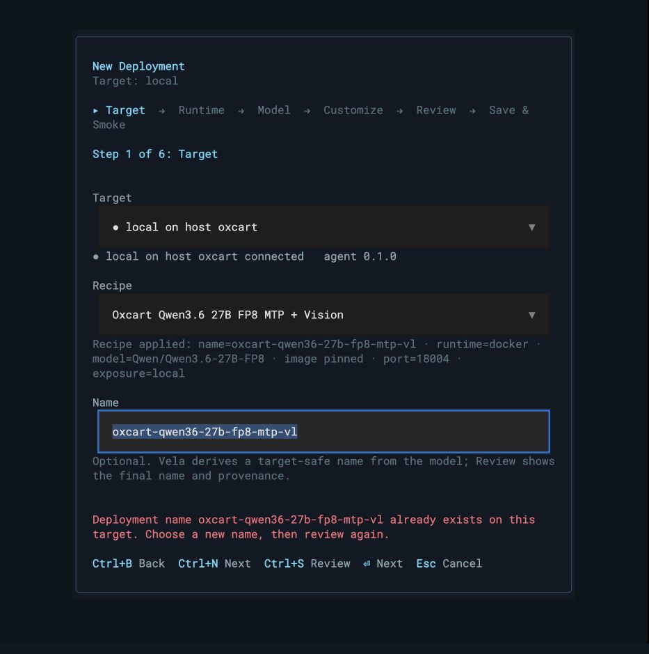

Choose a new name, compose Review again, and save:

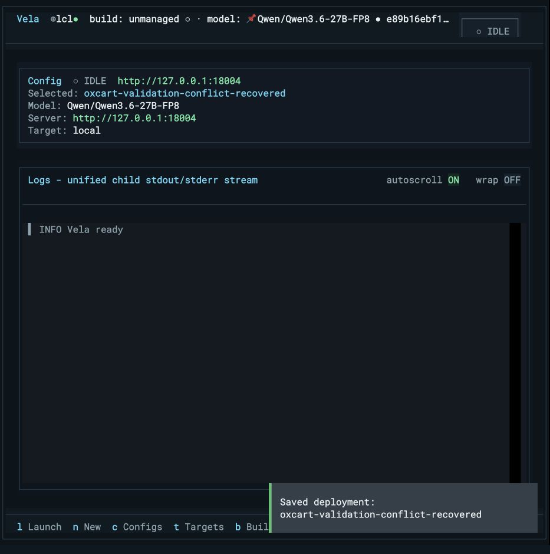

For scripted replacement, use CLI `--overwrite` only after reviewing the exact
destination and composed result.

## What this proves

This walkthrough proves the application workflow at one exact source revision:

- real target authority through the same controller/agent contract used by SSH;
- target-scoped recipe and hostname protection;
- digest-pinned Docker identity and full model commit resolution;
- readable provenance, flags, mounts, warnings, command, and redaction;
- no-launch Save semantics and cold profile restoration;
- real model loading, health, `/v1/models`, text, and vision requests;
- intentional Stop and complete run-owned cleanup; and
- controller responsiveness across the wider validation matrix.

It does **not** prove that the Oxcart image or flags work on another GPU, that a
different model is cached, that a public bind is secure, or that external release
gates such as merge/tag have happened. Treat screenshots as evidence for their
recorded source, not a substitute for a fresh target preflight.

The [screenshot provenance README](../img/tutorial/README.md) and
[`manifest.json`](../img/tutorial/manifest.json) record the original evidence
path, evidence-session start, runtime commit, byte size, and SHA-256 digest for
every image used here. The source pack does not record a per-frame capture time.

## Next steps

- Use the [Operations guide](../operations.md) for cloning, editing, logs,
  managers, transient model overrides, daemon work, and retention.
- Use [Builds and models](../builds-and-models.md) for build methods, model
  download, cache learning, and deep verification.
- Use [Docker runtime](../docker-runtime.md) for pull policy, cache mounts,
  lifecycle identity, migration, and export.
- Use the [complete CLI reference](../cli-reference.md) for exact arguments,
  options, JSON behavior, and canonical command spellings.
